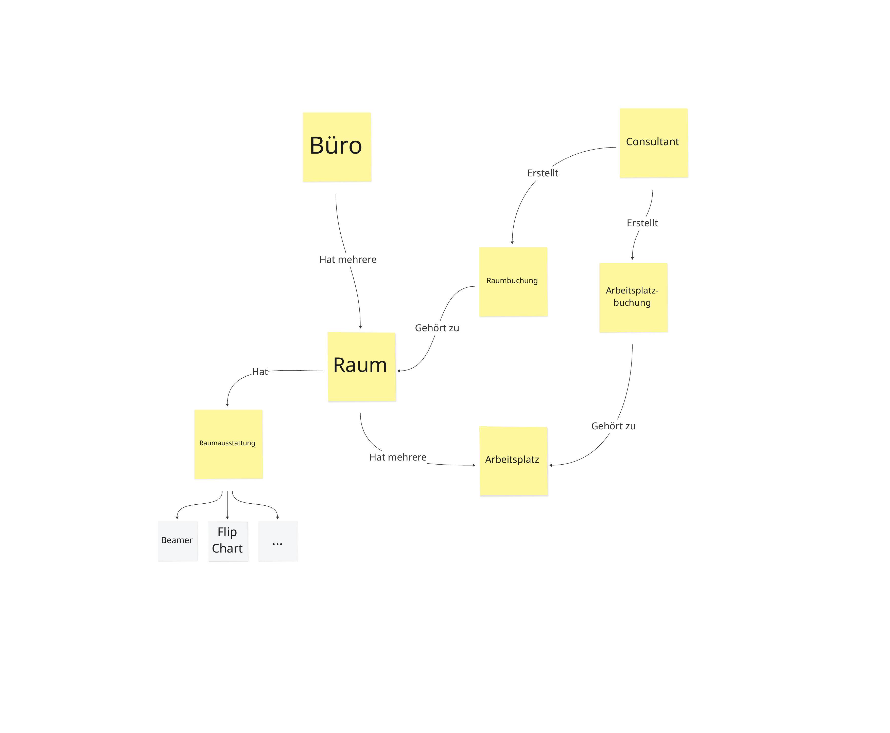

# Übung 1-1 (DEMO): Glossar

Der Startpunkt für unser System, das wir in diesem Training zusammen entwickeln, ist die Produktvision. In der Produktvision kommen viele Begriffe aus unserer Ubiquitous Language vor. Damit alle Begrifflichkeiten für den KI-Agenten klar definiert sind und der Agent sich an die Ubiquitous Language hält, definieren wir ein Glossar.

Informationsgrafik: Domäne (Diagramm anzeigen)

## Aufgabe

Unter `docs/product/product-vision.md` findest du die Produktvision. Erstelle aus der Produktvision ein Glossar und lege es unter `docs/product/glossary.md` ab.
