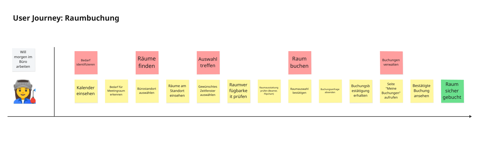
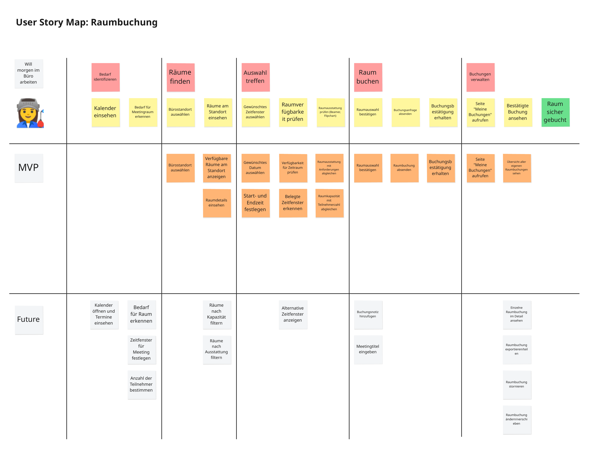

# Übung 1-3: Epic

In dem User-Story-Map-Workshop haben wir entdeckt, was passieren muss, um die User-Journey umzusetzen. Eine Markdown-Repräsentation existiert jetzt im Repository unter `docs/product/user-story-maps/raumbuchung.md`.

Die Backbone-Items aus der User-Story-Map lassen sich zu Epics mappen. Die Post-its unter den Backbone-Items lassen sich zu User-Stories übertragen.

Informationsgrafiken (anzeigen)

## Aufgabe

Erstelle einen Skill, der aus einem Backbone-Item der User-Story-Map einheitliche Epics erstellt.

## Anforderungen

- Das Backbone Item und die User-Story-Map muss über die `$ARGUMENTS` übergeben werden.
- Das Epic entspricht dem Backbone-Item.
- Epics werden unter `docs/product/backlog` abgelegt.
- Im Epic gibt es eine Liste an zugehörigen User-Stories. Wichtig: Die User-Story-Tickets werden noch nicht erstellt. Es werden nur die User-Story-Sätze im Epic aufgelistet.
- Alle Epics sind einheitlich fortlaufend benannt als: `CLVN-<NUMBER>-EPIC-<NAME>` ohne doppelte Ticketnummern.
- Commands werden unter `.claude/commands` abgelegt.

Erstelle eine Markdown-Datei `.claude/skills/epic/SKILL.md`, in der der Prompt zum Erstellen des Epics liegt. Mit `/epic` kannst du den Skill dann ausführen.

Sollte `/epic` nicht gefunden werden, oder die Änderungen aus dem Prompt nicht berücksichtigt werden, musst du Claude Code neu starten.

## Docs

https://code.claude.com/docs/en/skills
