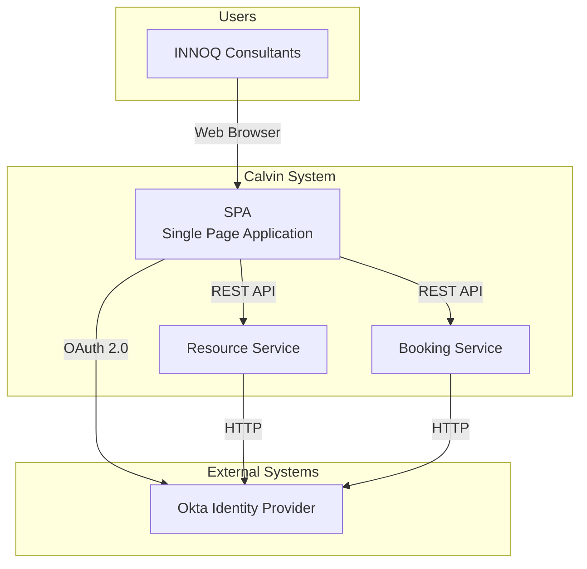

# Bausteinansicht

## Stufe 1: Systemüberblick (Whitebox Calvin)

Das Calvin-System gliedert sich in drei eigenständige Services:

### Enthaltene Bausteine

| Name | Beschreibung | Verantwortlichkeit |
|------|--------------|-------------------|
| **SPA** | Single Page Application (Frontend) | Benutzerinteraktion, UI/UX, Client-side Routing |
| **Resource Service** | Verwaltung von Büros, Räumen und Arbeitsplätzen | CRUD für Ressourcen |
| **Booking Service** | Buchungsverwaltung und Geschäftslogik | Buchungslogik, Konfliktauflösung, Validierung |

### Wichtige Schnittstellen

- **SPA ↔ Resource Service**: REST API für Ressourcenabfragen und -verwaltung
- **SPA ↔ Booking Service**: REST API für Buchungsoperationen
- **Okta Integration**: OAuth 2.0 Authentication für alle Services