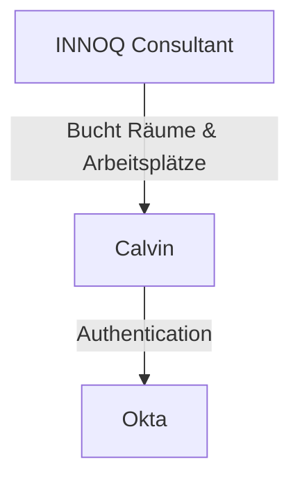

# Kontextabgrenzung

## Überblick

Das Calvin-System ist INNOQs internes Raum- und Arbeitsplatzbuchungssystem. Das System operiert in einem minimalen Systemkontext mit nur einer externen Abhängigkeit.

## Systemkontext

### External System: Okta
Okta fungiert als zentraler Identity Provider für INNOQs Infrastruktur:
- **Abhängigkeitstyp**: Kritische Abhängigkeit für Authentication
- **Protokoll**: OAuth 2.0
- **Funktionen**:
  - Benutzerauthentifizierung
  - Single Sign-On (SSO)
  - Autorisierung basierend auf INNOQ-Gruppen