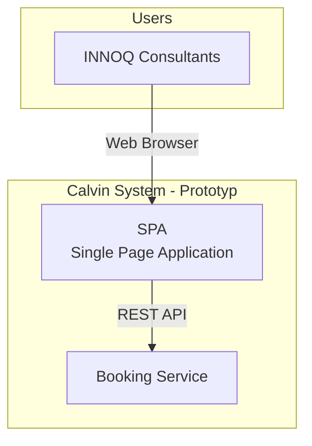

# Bausteinansicht

## Stufe 1: Systemüberblick (Whitebox Calvin)

Das Calvin-System besteht aus einer SPA mit integriertem Resource Service und einem separaten Booking Service. Diese Architektur wurde für die Prototyping-Phase optimiert (siehe ADR-002 und ADR-003):

### Enthaltene Bausteine

| Name | Beschreibung | Verantwortlichkeit |
|------|--------------|-------------------|
| **SPA** | Single Page Application (Frontend) | Benutzerinteraktion, UI/UX, Client-side Routing |
| **Booking Service** | Buchungsverwaltung und Geschäftslogik | Buchungslogik, Konfliktauflösung, Validierung |

### Wichtige Schnittstellen

- **SPA ↔ Booking Service**: REST API für Buchungsoperationen