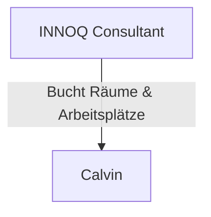

# Kontextabgrenzung

## Überblick

Das Calvin-System ist INNOQs internes Raum- und Arbeitsplatzbuchungssystem. Das System operiert in einem minimalen Systemkontext.

## System Context Diagram

```mermaid
graph TD

    %% External Actors (UML Actor style)
    Consultant[INNOQ Consultant]
    
    %% Calvin System
    Calvin[Calvin]
    
    %% User interactions
    Consultant -->|Bucht Räume & Arbeitsplätze| Calvin
    
    class Consultant userClass
    class Calvin systemClass
```
