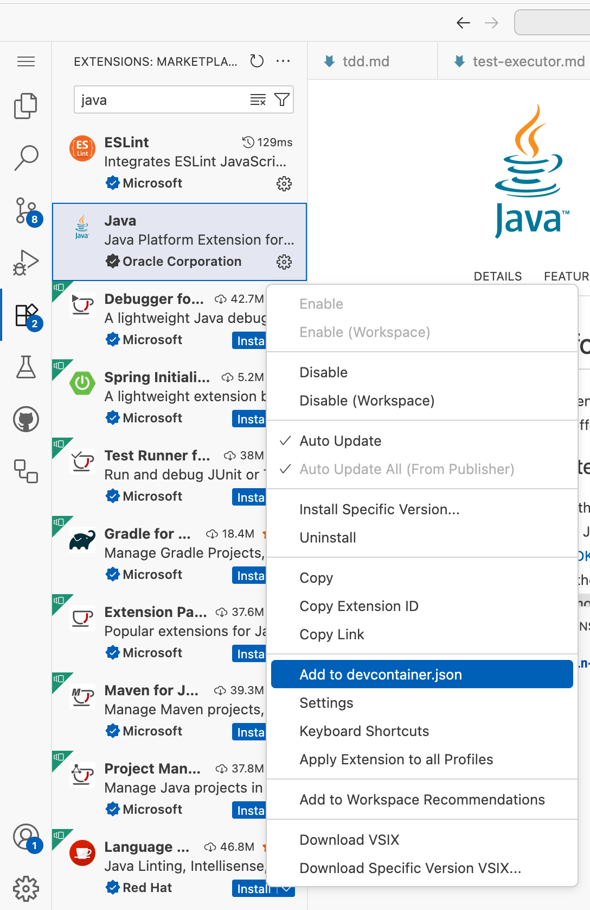

# Übung 3-1: SDK Setup

In der letzten Übung habt ihr euch für eine Technologie für euer Backend entschieden. Damit ihr mit dieser Technologie entwickeln könnt, müssen im Codespace die nötigen SDKs und VS-Code-Extensions installiert werden.

Screenshot (anzeigen)

## Aufgabe

- Erstellt mithilfe von Claude Code ein Bash-Skript, das die nötigen SDKs für eure Backend-Technologie installiert, und legt es im Repository unter `scripts/install-sdk.sh` ab.
- Führt das Skript aus und installiert das SDK.
- Öffnet den Extensions-Tab und installiert die für eure Technologie notwendigen Extensions. Welche das sind, könnt ihr Claude Code fragen.
- Fügt die neu installierten Extensions zusätzlich in der `devcontainer.json` hinzu.

## Hinweis

Nach einem Neustart des Codespaces müsst ihr das Skript zum Installieren des SDKs neu ausführen. Um das zu automatisieren, könnt ihr das Skript in der `devcontainer.json` auch automatisch als `onCreateCommand` ausführen. Dependencies könnt ihr dann automatisiert im `postCreateCommand` installieren lassen.
