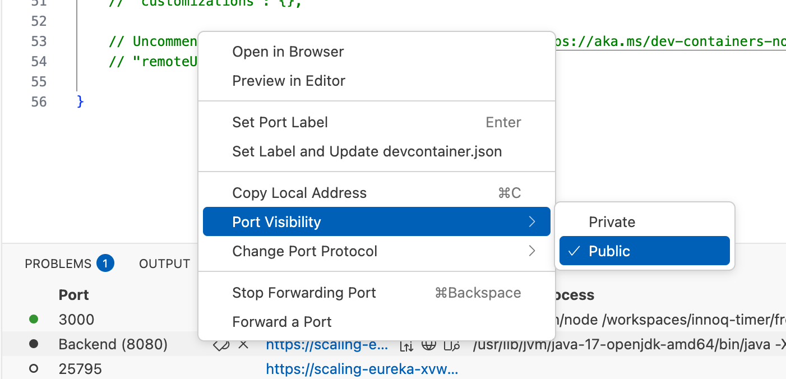

# Übung 3-2: Backend aufsetzen

Damit wir in den folgenden Übungen mit der "richtigen" Implementierung starten können, müssen wir unser Backend erst richtig aufsetzen.

Screenshot (anzeigen)

## Aufgabe

- Erzeuge eine lauffähige Backend-Anwendung in eurer gewählten Technologie (nutze einen Initializer, z. B. Spring Initializr / `rails new` / `npx create-next-app` / etc.).
- Das Backend muss unter `backend/` liegen.
- Erzeuge einen Endpunkt unter `/api/hello`, der `Hello World!` antwortet.
- Installiere die Dependencies des Frontends über `npm ci` und starte es über `npm run dev`.
- Verbinde das Frontend mit dem Backend und frage den `/api/hello`-Endpunkt an. Gib das Ergebnis aus, um eine laufende Verbindung zwischen Front- und Backend zu testen.

## Hinweis (Codespaces im Browser)

Da Front- und Backend innerhalb des Codespaces laufen, können wir nicht über `localhost` zugreifen. GitHub macht aber ein automatisches Port-Forwarding und bietet den Port unter `https://CODESPACENAME-PORT.app.github.dev` an. Unser Frontend (SPA) kann über diese URL auf die Backend-API zugreifen.

Nötiges Setup:

1. Im Frontend-Code die Codespace-URL zum Zugriff auf die Backend-API verwenden.
2. Den Backend-Port auf "public" stellen. Sonst kann das Frontend ohne entsprechende GitHub-Credentials in den Request-Headern nicht auf das Backend zugreifen.
3. Im Backend CORS für die Frontend-Codespace-URL erlauben.

## Hinweis (Spring)

Installiere in VS Code das Spring Extension Pack und nutze dort den Initializer.
