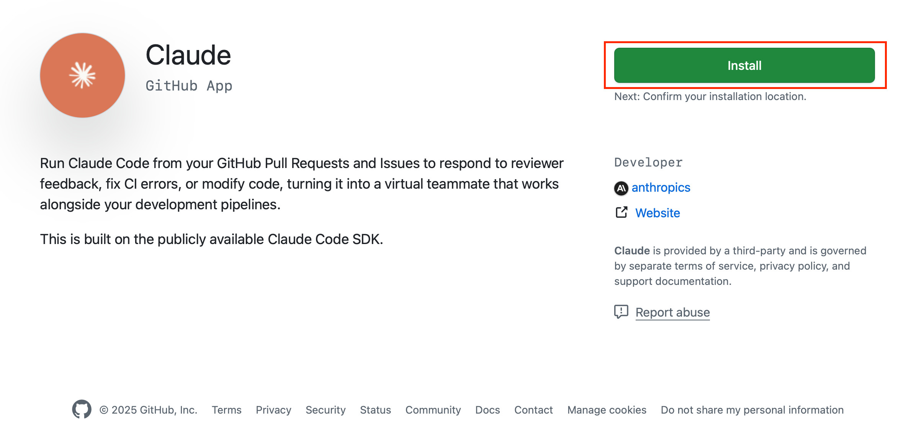
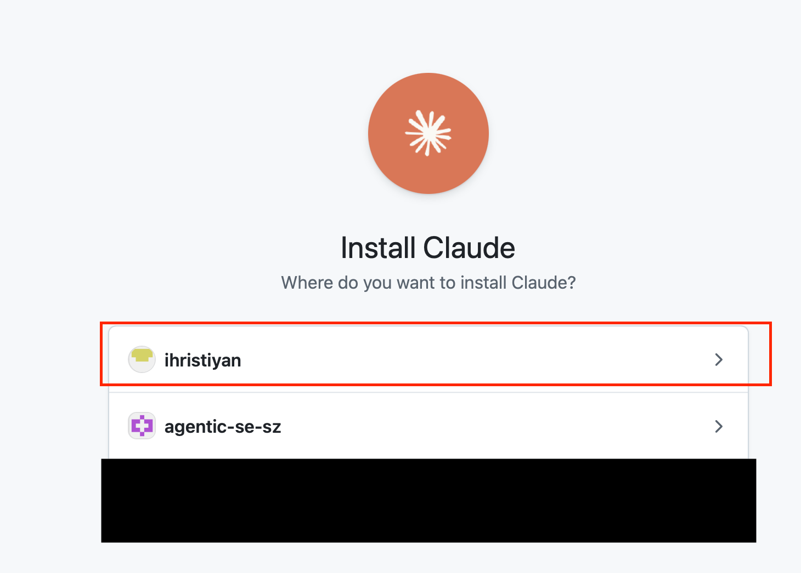
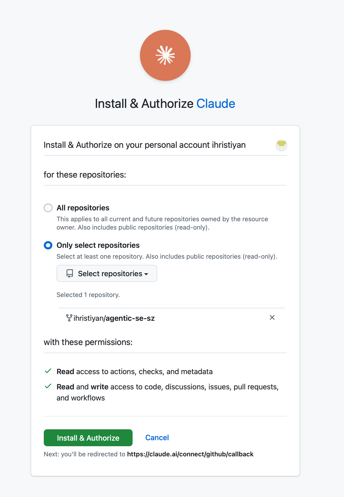
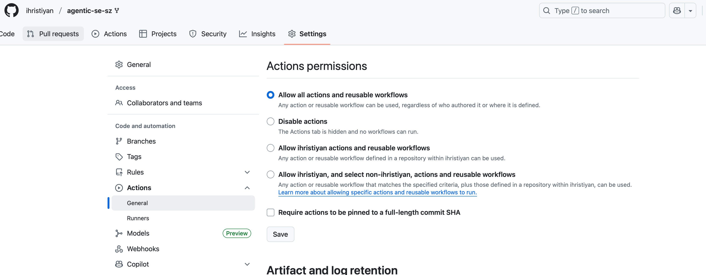
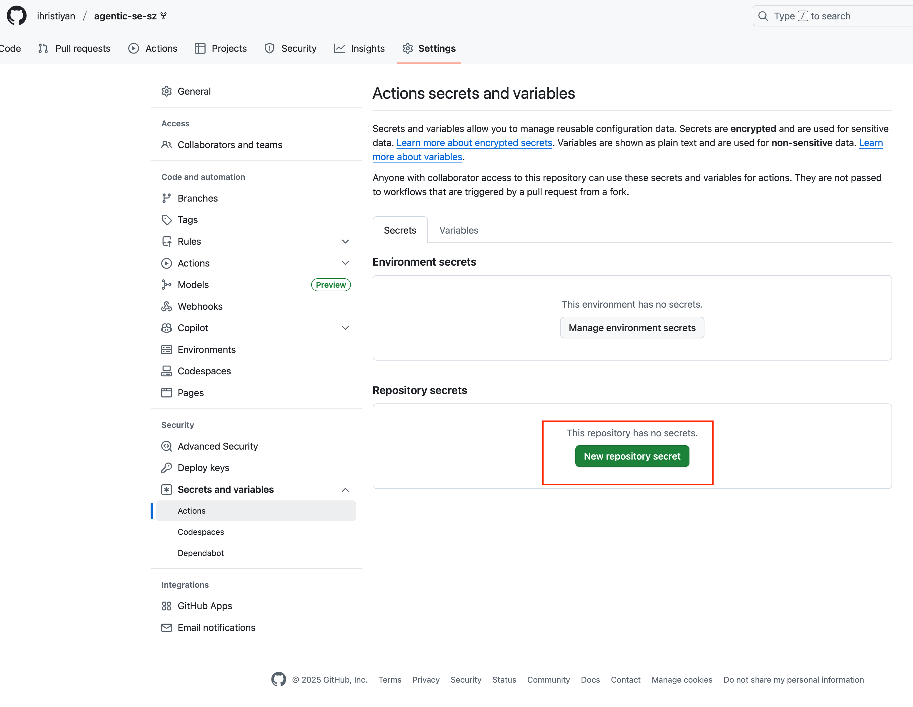
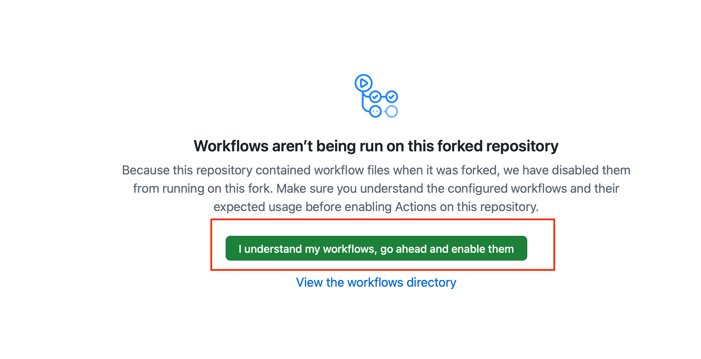

# Übung 3-8: Review

Claude Code können wir auch in GitHub installieren und Reviews für uns machen lassen. Das wollen wir jetzt tun.

Screenshots (anzeigen)

## Aufgabe 1: Setup

1. Wechsle zurück auf den Main-Branch. Deine Änderungen aus der Coding-Session sollten auf dem Feature-Branch bleiben.
2. Installiere Claude Code für dein geforktes Repository in GitHub: https://github.com/apps/claude
3. Hinterlege den API Key als Actions Secret für das Repository: `Settings > Secrets and Variables > Actions`. Nenne das neue Secret: `AWS_BEARER_TOKEN_BEDROCK`.
4. Aktiviere GitHub Actions für dein Repository im Actions Tab.

## Aufgabe 2: Über Findings iterieren

Nachdem du dein erstes Review vom Agenten bekommen hast, gibt es wahrscheinlich Findings, die gefixt werden müssen.

Iteriere zusammen mit dem Agenten über die Findings und fixe die wichtigen Punkte, bis du den PR mergen würdest.

## Hinweis

Installiere die Claude App über deinen eigenen Account. Falls du die Organisation auswählst, wird ggf. ein Install-Request zum Orga-Admin geschickt, statt die App direkt zu installieren.

Docs:

https://docs.anthropic.com/en/docs/claude-code/github-actions
https://github.com/anthropics/claude-code-action/blob/main/src/create-prompt/index.ts
