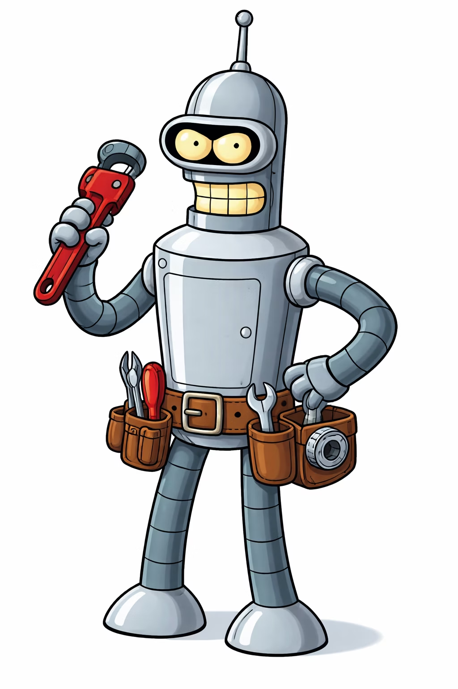
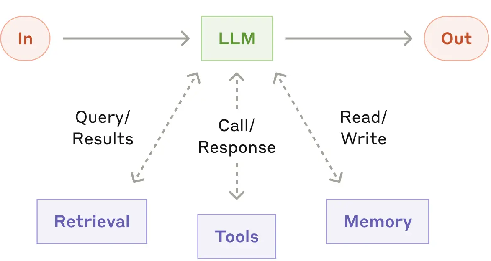
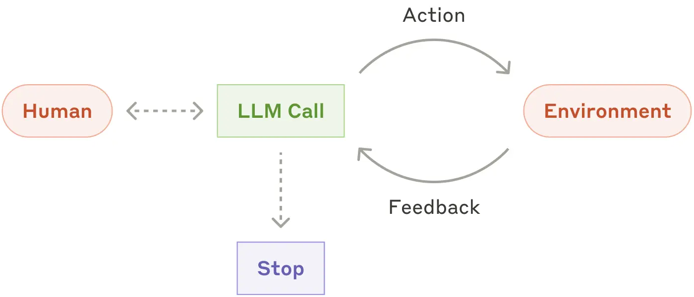

### *Understanding*
# The Agent Harness

---
layout: content-with-image
---

# What is an agent?

- Uses an interchangeable LLM as a brain
- Has memory loss after a couple of beers
- Can change the environment
- Has access to external sources
- Has a set of tools to get the job done
- Got an attitude

::image::

<!--
Manages the context for you. Or tries to.
-->

---
layout: sidebar
sidebarBackground: petrol
image: /backgrounds/5.webp
---

# Environment

- Filesystem (code, configs, docs)
- Version Control (git)
- APIs and Services
- Databases
- Terminal / Shell
- IDE / LSP

## The agent's "world"

::sidebar::

<h3 class="text-center">What the agent <em>operates on</em></h3>

---
layout: center
background: petrol
---

## The agent *modifies* the environment to achieve goals.

## Unlike assistants that return data, agents *change state*.

---
layout: sidebar
sidebarBackground: petrol
image: /backgrounds/5.webp
---

# Tools

- Read (files, code, config)
- Write (create, edit, delete)
- Execute (commands, tests, builds)
- Search (grep, find, LSP)

<h3 mt-10> Tools define the <em>capability boundary</em> of the agent</h3>

::sidebar::

<h4 class="text-center">How agents interact with the <em>environment</em></h4>

---
layout: sidebar
sidebarBackground: petrol
image: /backgrounds/5.webp
---

# Observation & Feedback

What agents observe:
- Tool Results - Output from actions
- Error Messages - Compilation, runtime
- Test Results - Pass/fail status
- Diagnostics - LSP warnings, lints
- State Changes - Git diff, file changes

::sidebar::

<h4 class="text-center">Closing the <em>loop</em></h4>

---

# The Control Loop

  

    <ArcLine
      class="text-petrol"
      center="50% 56%"
      radius="36%"
      :startAngle="77"
      :endAngle="143"
      head="arrow"
      :strokeWidth="3"
      clockwise
    />
    <ArcLine
      class="text-petrol"
      center="50% 56%"
      radius="36%"
      :startAngle="-33"
      :endAngle="23"
      head="arrow"
      :strokeWidth="3"
      clockwise
    />
    <ArcLine
      class="text-petrol"
      center="50% 56%"
      radius="36%"
      :startAngle="197"
      :endAngle="283"
      head="arrow"
      :strokeWidth="3"
      clockwise
    />
    <EmojiStack class="absolute anchor-center left-[60%] top-[20%]" name="zap" size="lg">
      <h3>Act</h3>
      
Execute tool, modify environment

    </EmojiStack>
    <EmojiStack class="absolute anchor-center left-[63%] top-[77%]" name="eye" size="lg">
      <h3>Observe</h3>
      
Read results, evaluate progress

    </EmojiStack>
    <EmojiStack class="absolute anchor-center left-[30%] top-[62%]" name="brain" size="lg">
      <h3>Reason</h3>
      
Analyze situation, plan next step

    </EmojiStack>
  

---
layout: comparison
leftBackground: apricot
rightBackground: petrol
leftBodyBackground: white
rightBodyBackground: white
---

::left::

# Assistant

- **Linear** execution path
- Returns data to human
- Human provides context
- No environment modification

::right::

# Agent

- Uses **iterative feedback** loop
- Modifies environment directly
- Discovers own context
- Self-corrects on errors

::badge::

  
vs.

<!--
(Assistants)
Assistants bekommen einen Prompt und liefern eine Ausgabe

Sie können für eine bessere Ausgabe auch auf Daten, und Tools zurückgreifen.

Ziel ist es aber am Ende einen Output-Text zu produzieren

(Agents)
Agents gehen jetzt noch weiter.

Sie sollen Aufgaben übernehmen.

Wichtig ist nicht mehr die Ausgabe, sondern dass die Umgebung beeinflusst wurde.

Dabei hängen sie in einer Feedback-Schleife mit der Umgebung uns stoppen erst, wenn sie von der Umgebung das Feedback bekommen haben, dass die Aufgabe gelöst ist

Der Mensch gibt nur noch einen Prompt rein und den Rest übernimmt der Agent.

Die Umgebung wird dabei durch Tools beeinflusst.
-->

---
layout: center
background: petrol
---

# Think of agents as *interns*. Always *verify* their work.
