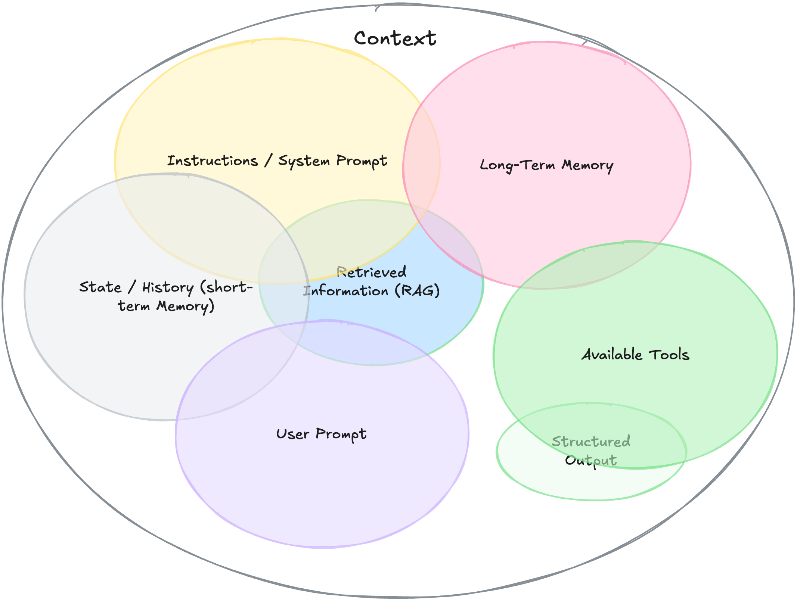

## This autoregressively generated *input   sequence* is what we call *context*.

<!-- Master reference: Chapter 1 / Slide 031 -->

---

# Context is the *whole* knowledge

- On every new task, we start with a new context
- Everything from a previous conversation is lost
- There's no knowledge transfer between conversations
- "Learning" or tuning of the model's parameters is solely done during training
- All the information required for a task, needs to be in the context

<!-- Master reference: Chapter 1 / Slide 032 -->

---
layout: center
---

<h1 class="text-7xl">👑 Context</h1>
<h2 class="font-serif italic text-accent text-5xl">is King</h2>

<!--
Master reference: Chapter 1 / Slide 033

Wenn LLMs nicht lernen und keine Memory haben, dann ist Context alles!

Das LLM kann nur auf die Informationen zugreifen, die ihr ihm in der aktuellen Session gebt.

Da gibt es nur ein Problem…
-->

---
slideNumber: false
---

# The Context Window

<ContextWindowAnimation h-380px text-xs leading-tight :tokens="tokens" :speed="12" :prefill="80" />

<!--
- Kontext kann nicht beliebig lang sein.
- Wird durch Kontextfenster limitiert.
- Alles was nicht rein passt wird vergessen.
- Stark vereinfachte Darstellung.
- Was vergessen wird, wird von Agents unterschiedlich implementiert
-->

---

# Context Window Sizes

<LogoRow class="h-full">
  <LogoCard name="400K" subtitle="GPT-5.2">
    
  </LogoCard>
  <LogoCard name="200K" subtitle="Claude Sonnet 4.5">
    
  </LogoCard>
  <LogoCard name="1M" subtitle="Gemini 3 Pro">
    
  </LogoCard>
  <LogoCard name="131K" subtitle="DeepSeek V3.2">
    
  </LogoCard>
  <LogoCard name="256K" subtitle="Qwen 3 Coder">
    
  </LogoCard>
</LogoRow>

<!--
Master reference: Chapter 1 / Slide 035

Ist das Kontext-Fenster ausgeschöpft, fallen alte Informationen hinten über, wenn neue Informationen hinzugefügt werden

Context ist begrenzt.

Jedes LLM hat ein Context Window - eine maximale Anzahl von Tokens, die es gleichzeitig verarbeiten kann.

Bei modernen Modellen sind das 100k bis 200k Tokens.

Ach wenn das Kontextfenster eines Modells größer ist, setzt Context-Rot ein, was den Nutzen wieder zunichte macht.

Quellen:

https://developers.openai.com/api/docs/models/gpt-5.4

https://claude.com/blog/1m-context-ga

https://ai.google.dev/gemini-api/docs/models?hl=de

https://docs.mistral.ai/models/devstral-2-25-12

https://qwen.ai/blog?id=qwen3.5
-->

---
layout: sidebar
sidebarBackground: white
---

Image by https://www.philschmid.de/context-engineering

::sidebar::
## What's really *relevant*?

<!--
Master reference: Chapter 1 / Slide 036

Die Kunst liegt darin herauszufinden: Was ist wirklich relevant für meinen Task? Nicht alles kann in den Context, also müssen wir auswählen.
-->

---
layout: intro
background: apricot
---

# Memory

<!-- Master reference: Chapter 1 / Slide 037 -->

---

# Short-Term Memory

- Everything, that is in the current session
- Temporary and limited (context window)
- All the information required for the current task needs to be included
- The model will generate new content based on this information
- Awareness of context challenges is needed to optimize the model's output

<!-- Master reference: Chapter 1 / Slide 038 -->

---

# Long-Term Memory

- Persistent knowledge across multiple sessions
- Must be actively saved & retrieved
- Could be externally stored data such as...
  - Markdown Documents
  - Databases
  - Knowledge Graphs

<!-- Master reference: Chapter 1 / Slide 039 -->
