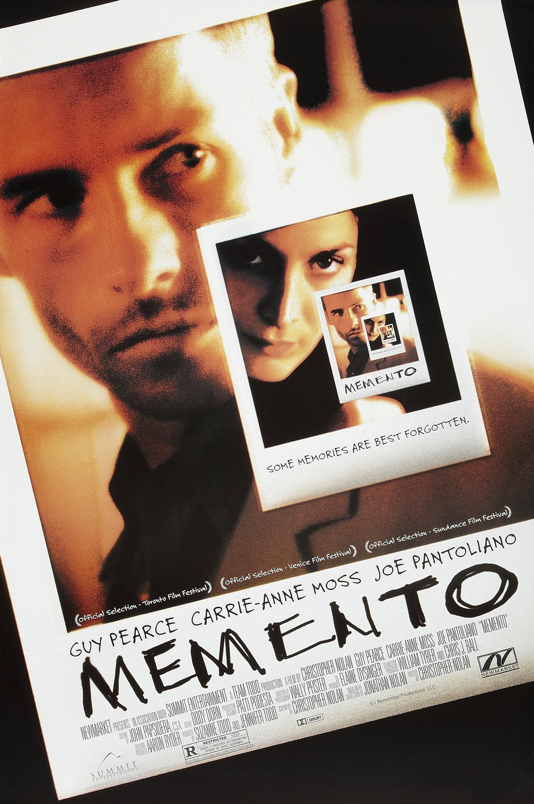

## This autoregressively generated *input   sequence* is what we call *context*.

---

# Context is the only knowledge

- On every new task, we start with a new context
- Everything from a previous conversation is lost
- There's no knowledge transfer between conversations
- "Learning" or tuning of the model's parameters is solely done during training
- All the information required for a task, needs to be in the context

---
layout: center
background: petrol
---

## *Context* is king.

<!--
Wenn LLMs nicht lernen und keine Memory haben, dann ist Context alles!

Das LLM kann nur auf die Informationen zugreifen, die ihr ihm in der aktuellen Session gebt.

Da gibt es nur ein Problem…
-->

---
slideNumber: false
---

# The Context Window

<ContextWindowAnimation h-380px text-xs leading-tight :tokens="tokens" :speed="12" :prefill="80" />

<!--
- Kontext kann nicht beliebig lang sein.
- Wird durch Kontextfenster limitiert.
- Alles was nicht rein passt wird vergessen.
- Stark vereinfachte Darstellung.
- Was vergessen wird, wird von Agents unterschiedlich implementiert
-->

---

# Context Window Sizes

<LogoRow class="h-full">
  <LogoCard name="1M" subtitle="GPT-5.5">
    
  </LogoCard>
  <LogoCard name="1M" subtitle="Claude Opus 4.8">
    
  </LogoCard>
  <LogoCard name="1M" subtitle="Gemini 3.1 Pro">
    
  </LogoCard>
  <LogoCard name="256K" subtitle="Devstral 2">
    
  </LogoCard>
  <LogoCard name="256K" subtitle="Qwen 3 Coder">
    
  </LogoCard>
</LogoRow>

<!--
Context ist begrenzt. Jedes LLM hat ein Context Window – eine maximale Anzahl von Tokens, die es gleichzeitig verarbeiten kann.

Ist das Kontextfenster ausgeschöpft, fallen ältere Informationen hinten raus, wenn neue hinzukommen.

Die Frontier-Modelle konvergieren mittlerweile bei rund 1M Tokens (GPT-5.5, Claude Opus 4.8, Gemini 3.1 Pro). Offene Coding-Modelle wie Devstral 2 und Qwen 3 Coder liegen bei 256K.

Auch wenn das Kontextfenster sehr groß ist, setzt "Context Rot" ein – die Qualität der Verarbeitung nimmt bei sehr langen Contexts ab.

Quellen:

https://developers.openai.com/api/docs/models/gpt-5.5

https://docs.claude.com/en/docs/build-with-claude/context-windows

https://deepmind.google/models/model-cards/gemini-3-1-pro/

https://docs.mistral.ai/models/model-cards/devstral-2-25-12

https://github.com/QwenLM/Qwen3-Coder
-->

---
layout: default
footerLink: https://www.philschmid.de/context-engineering
---

  

    <h2 class="!mb-0">What's really <em>relevant</em>?</h2>
    
  

<!--
Die Kunst liegt darin herauszufinden: Was ist wirklich relevant für meinen Task? Nicht alles kann in den Context, also müssen wir auswählen.
-->

---
layout: intro
background: apricot
---

### *Let's talk about*
# Memory

---
layout: content-with-image
---

# Short-Term Memory

- Everything, that is in the current session
- Temporary and limited (context window)
- All the information required for the current task needs to be included
- The model will generate new content based on this information
- Awareness of context challenges is needed to optimize the model's output

::image::

---

# Long-Term Memory

- Persistent knowledge across multiple sessions
- Must be actively saved & retrieved
- Could be externally stored data such as...
  - Markdown Documents
  - Databases
  - Knowledge Graphs
