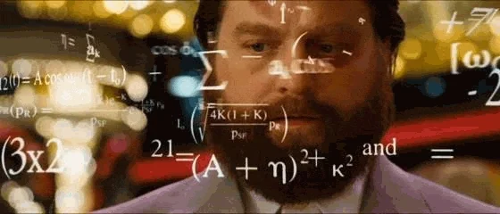
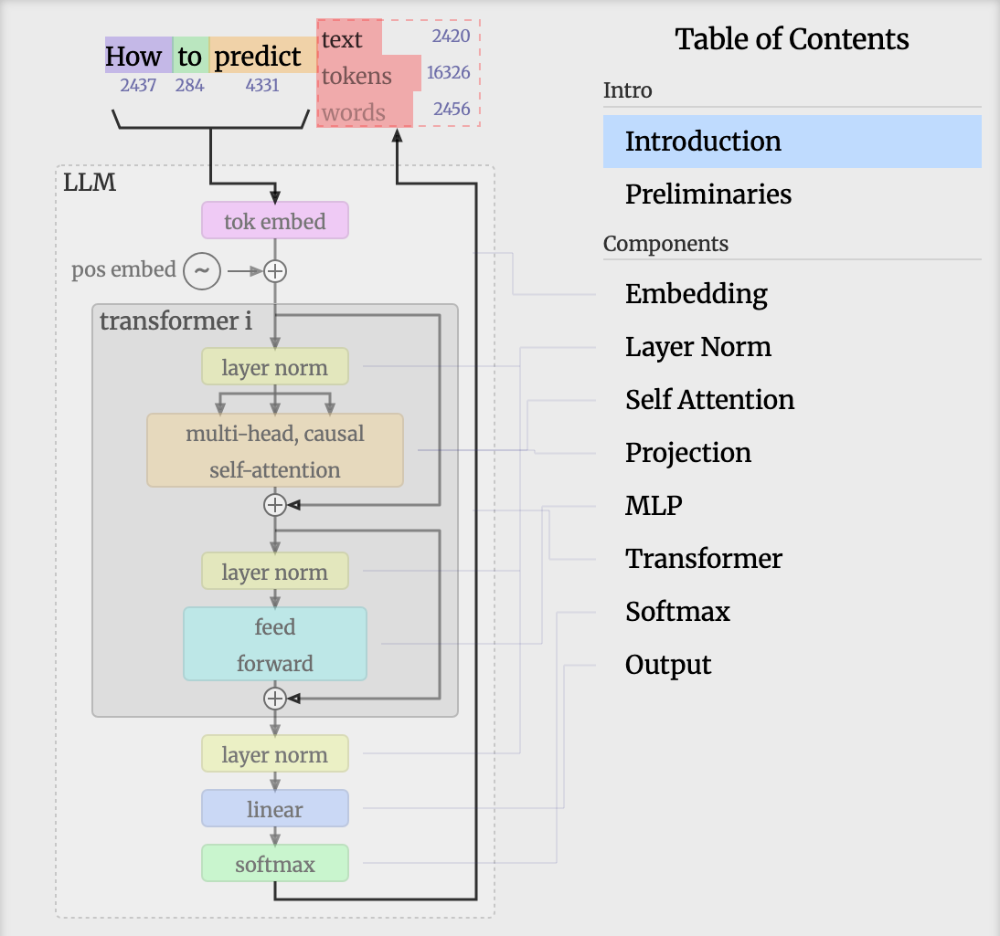

### *Let's understand*
# Large Language Models

---

# LLMs are *Calculators* for   the next best Token

  

        <Token value="You" />
        <Token value=" are" />
        <Token value=" a" />
        <Token value=" help" />
        <Token value="ful" />
        <Token value="assistant" />
        <Token value="." />
        <Token value=" Be" />
        <Token value=" conc" />
        <Token value="ise" />
        <Token value=" and" />
  

  

    <v-switch unmount>
      <template #0>
          

              LLM
          

      </template>
      <template #1>
          
      </template>
      <template #2>
          

              

                  h = Transformer(
                  i1, i2, i3, ..., in;
                   
                  p1, p2, p3, p4, ..., pn)
              

          

      </template>
    </v-switch>
  

  

    
<Token value=" clear" /> 0.6

    
<Token value=" give" /> 0.25

    
<Token value=" be" /> 0.02

  

  

      Input Sequence
      
→

  

  

      Linear algebra
      
→

  

  

      Output Probability
  

<!--
Das ist der Schlüssel zum Verständnis: LLMs sind fundamentale Rechner, die auf Basis einer Token-Sequenz die Wahrscheinlichkeit für den nächsten Token berechnen. Alles andere - Code-Generierung, Analyse, Kreativität - entsteht aus diesem einfachen Prinzip.

[click] Innerhalb des LLMs läuft eine komplexe Mathematische Berechnung ab, die uns Wahrscheinlichkeiten für den nächst besten Token berechnen.

[click] Diese Berechnungen basieren auf der Transformer-Technologie. Als Eingabe liefern wir unsere Inputs und eine lange Reihe von Parametern.

Diese Parameter wird beim Training eines Modells abgestimmt und sind für uns als feste Parameter zu sehen.

Somit ist unser einziger Einfluss die Input-Sequenz.
-->

---
layout: center
background: petrol
---

## The initial *input sequence* is   typically called a *Prompt*

---
layout: center
background: petrol
---

<h1 text-accent> Tokens ≠ Words</h1>

<!--
Tokens sind die Grundeinheit, mit der LLMs arbeiten - aber es sind nicht Wörter, sondern Wortteile. Ein häufiger Fehler ist anzunehmen, dass ein Wort gleich ein Token ist.

Im englischen passt es noch oft, im deutschen schon weniger.

Ganz zu schweigen von Source-Code.
-->

---
layout: demo
link: https://tiktokenizer.vercel.app/?model=gpt2
---

<!--
Hier seht ihr, wie Tokenization funktioniert.

Tiktokenizer öffnen und text einfügen

Source Code einfügen, da sehen die Tokens schon ganz anders aus.

Token-Bewusstsein schärfen:
- Teilnehmer schätzen Token-Anzahl verschiedener Code-Snippets
- Dann Verifikation mit tiktokenizer.vercel.app
-->

---
clicks: 6
---

# Autoregressive generation

<TokenPrediction :steps="[
  { token: 'Hello',  candidates: [[' world', 0.35], [' there', 0.28], [',', 0.20], ['!', 0.12]] },
  { token: ' world', candidates: [[',', 0.42], ['!', 0.25], ['.', 0.18], [' of', 0.10]] },
  { token: ',',      candidates: [[' how', 0.38], [' I', 0.22], [' my', 0.15], [' welcome', 0.12]] },
  { token: ' how',   candidates: [[' are', 0.45], [' do', 0.25], [' is', 0.18]] },
  { token: ' are',   candidates: [[' you', 0.62], [' we', 0.15], [' they', 0.12], [' things', 0.08]] },
  { token: ' you',   candidates: [['?', 0.55], ['!', 0.20], [' doing', 0.15], [' today', 0.08]] },
  { token: '?',      candidates: [['<|end|>', 0.85], [' I', 0.06], ['  \n', 0.04], [' Thank', 0.03]] },
]" />

<!--
Für jeden Token berechnet das LLM Wahrscheinlichkeiten für alle möglichen nächsten Tokens. Meist gewinnt nicht der wahrscheinlichste, sondern es wird zufällig basierend auf den Wahrscheinlichkeiten gewählt – das ist der Zufallsfaktor, der LLMs nicht-deterministisch macht.

Die Probability-Werte werden mit Softmax normalisiert, sodass die Summe über alle möglichen Werte 1 beträgt. Da wir nur die Top-Kandidaten zeigen, ist die angezeigte Summe etwas kleiner als 1.

- [click] Starten mit dem ersten Token – mehrere Kandidaten, einer wird gezogen.
- [click] Mit jedem neuen Token verändert sich die Wahrscheinlichkeitsverteilung für den nächsten Token.
- [click] So wird ein Token nach dem anderen ermittelt …
- [click] Und mit in die nächte Input-sequenz gehangen
- [click] Der Satz könnte hier enden...
- [click] ...und tut es. Dieser Vorgang wiederholt sich immer weiter, bis ein End-Token gezogen wird oder ein Limit erreicht wird.
-->

---

## Constrained Creativity: Steering Token Choice

**1. Top-k**
- "Choose from the **k most likely tokens**"
- Balances output:
  - **Low k** → focused, deterministic
  - **High k** → more creative, but potentially less coherent

**2. Top-p (Nucleus Sampling)**
- "Choose from tokens whose **cumulative probability ≥ p**"
- Dynamic token pool based on uncertainty
- More adaptive than Top-k: token count can vary depending on the distribution

<!--
(Deterministic)
Wenn das LLM immer den wahrscheinlichsten Token nimmt, ist es deterministisch – gleicher Input liefert immer denselben Output.

(Top-K)
Falls jemand nachbohrt:

Der Algorithmus für die Auswahl des finalen Tokens ist in etwa folgendermaßen:

- Erzeuge Zufallszahl zwischen 0 und 1
- Ist diese kleiner als die Probability von Token 1 → Token 1 gewinnt
- Ist diese größer als Token 1, aber kleiner als die Summe der Probability von Token 1 und 2 → Token 2 gewinnt
- usw.

(Top-P (Nucleus Sampling))
Das passt gut bei hoher Temperatur, weil bei hohem T die Anzahl der möglichen Token größer wird und ein Abschneiden bei einem fixen Wert k die Wirkung der höheren Temperatur wieder aufheben könnte.
-->

---

**3. Temperature**
- "Scales token probabilities before sampling"
- Controls randomness:
  - **Low temp (e.g. 0.2--0.5)** → conservative, deterministic
  - **High temp (e.g. 1.5--2.0)** → diverse, creative, less predictable

**Combined Effect**
- The model generates logits
- **Temperature** scales the logits
- **Top-k** limits to the k most likely tokens
- **Top-p** trims this list to tokens with cumulative probability ≥ p
- The final token is sampled randomly from this set

→ Balances **coherence and creativity**

<!--
Falls jemand detailliert fragt, die Formel für Softmax mit Temperature ist:

softmax_i = exp(z_i / T) / sum_j exp(z_j / T)

softmax_i = Rating eines Tokens
z_i = der reine Output des Netzes (Logit) für diesen Token
z_j = Index über alle anderen Token
T = Temperature

Bei T = 0 wird per Konvention der höchste Token auf 1 gesetzt (Wäre ja sonst Division durch 0)

Mehr Quellen:

https://towardsdatascience.com/a-comprehensive-guide-to-llm-temperature/

https://medium.com/thinking-sand/mastering-llm-temperature-a-step-by-step-guide-81e9f27fef77
-->

---
layout: center
background: apricot
footerLink: https://bbycroft.net/llm
---

## Further Information

---
layout: sidebar
sidebarBackground: petrol
image: /backgrounds/4.webp
footerLink: https://cookbook.openai.com/articles/openai-harmony#special-tokens
slideNumber: false
footerDir: reverse
---

## Teaching to converse

- Special tokens are introduced during subsequent training sessions:
  - <Token text-sm leading-tight value="<|start|>" />
  - <Token text-sm leading-tight value="<|message|>" />
  - <Token text-sm leading-tight value="<|end|>" />
- These tokens allow us to represent a conversation
- LLMs are good at replicating patterns, so they can continue the conversation naturally

::sidebar::

<h4 class="text-center">From <em>text completion</em> to <em>assistant</em></h4>

<!--
In einem erweiterten Training werden dem Base-Model spezielle Tokens hinzugefügt, mit denen eine Konversation dargestellt werden kann.

So kann das Modell nun auf Konversationen trainiert werden. Dazu werden Testdaten in Form von üblichen Konversationen verwendet.

LLMs sind gut darin Muster fortzuführen. Somit kann es eine angefangene Konversation Fortsetzen.

Unser Input endet mit <|start|>assistant<|message|> und das LLM fügt die Antwort des Assistenten an.
-->

---

# Structured Output

- Text needs full-text parsing, which is complex and error-prone.
- Instead, force the LLM to return its output in a specific format, such as JSON
- Provide a JSON schema in the prompt
- Tell the model it must adhere to the schema
- Then, it returns JSON
