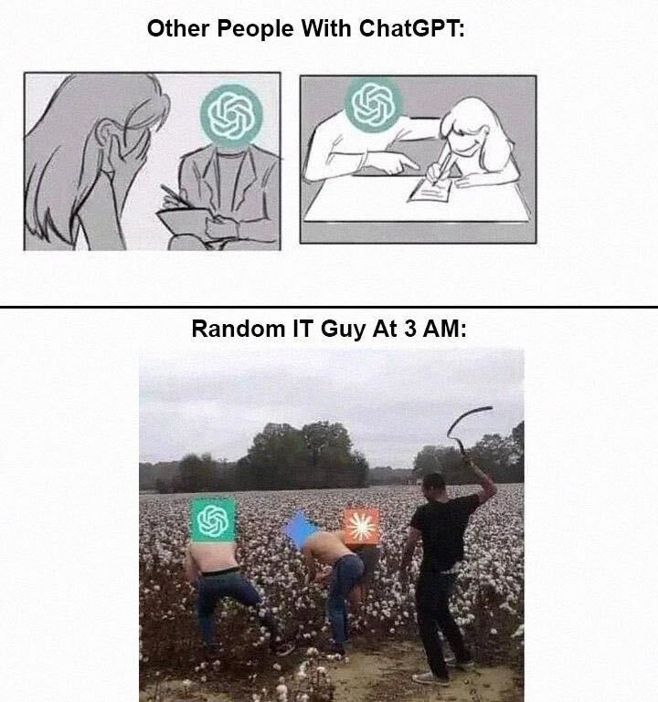

# Introduction & Basics

---
layout: demo
link: https://chatgpt.com

<!--
Lasst uns mit etwas Vertrautem starten.

ChatGPT kennt ihr bestimmt alle, oder?

Schauen wir uns kurz an, was dahinter steckt.

[Demo: Einfache Code-Frage an ChatGPT]

```
Wie benutze ich ein Promise in Typescrpt?
```

Das sieht einfach aus, aber dahinter steckt...
-->

---

<!-- Master reference: Chapter 1 / Slide 009 -->

---
layout: center
---



<!-- Master reference: Chapter 1 / Slide 010 -->

---
src: ./foundation-models/slides.md
---

---
src: ./large-language-models/slides.md
---

---
src: ./context-and-memory/slides.md
---

---
src: ./tools-and-mcp/slides.md
---

---
src: ./agent-harness/slides.md
---

---
src: ./agent-landscape/slides.md
---

---
layout: demo
kicker: Exercise
---

<!-- Master reference: Chapter 1 / Slide 054 -->

---
layout: center
background: petrol
---

### *Chapter 1*
# Key Takeaways

1. LLMs are token calculators
2. Context is king
3. Agents run in a feedback loop
4. They change state to reach a goal

<!--
Master reference: Chapter 1 / Slide 058

Die drei wichtigsten Erkenntnisse aus Block 1:

- LLMs sind fundamentale Token-Rechner ohne Memory
- Context entscheidet über Erfolg oder Misserfolg
- und verschiedene Tools für verschiedene Anwendungsfälle.
-->

---
layout: intro
background: petrol
---

### *Introduction to*
# Codespaces

<!--
Master reference: Chapter 1 / Slide 059

- Open Codespace
- Start Claude Code
- Basic navigation
- One Shot Example:
"Schreibe mir mal ein Raumbuchungssystem für INNOQ"
-->
