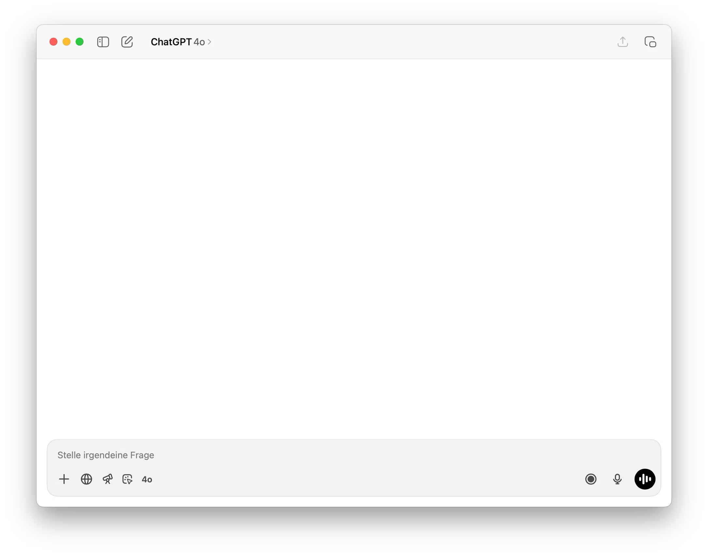

# Introduction & Basics
Mach 
---
layout: center
background: petrol
disabled: true
---

<div mt-10 relative>
    
    <div absolute inset-0 grid place-items-center text-4xl italic font-serif text-petrol>
        Demo
    </div>
</div>

https://chatgpt.com

<!--
Lasst uns mit etwas Vertrautem starten.

ChatGPT kennt ihr bestimmt alle, oder?

Schauen wir uns kurz an, was dahinter steckt.

[Demo: Einfache Code-Frage an ChatGPT]

```
Wie benutze ich ein Promise in Typescrpt?
```

Das sieht einfach aus, aber dahinter steckt...
-->

---
layout: center
disabled: true
---


---
src: ./foundation-models/slides.md
---

---
src: ./large-language-models/slides.md
---

---
src: ./context-and-memory/slides.md
---

---
src: ./tools-and-mcp/slides.md
---

---
src: ./agent-harness/slides.md
---

---
src: ./agent-landscape/slides.md
---

---
layout: demo
kicker: Exercise
---

<!--
Übung am Whiteboard / Miro: Welche Tools kennt ihr?

Tools auf einem Strahl plazieren der von Less- zu Full-Autonom führt
-->

---
layout: takeaways
background: petrol
chapter: 1
---

1. LLMs are token calculators
2. Context is king
3. Agents run in a feedback loop
4. They change state to reach a goal

<!--
Die vier wichtigsten Erkenntnisse aus Block 1:

- LLMs sind fundamentale Token-Rechner – sie berechnen Token für Token die Wahrscheinlichkeit des nächsten Tokens
- Context ist alles: Ohne die richtigen Informationen im Context kann das LLM die Aufgabe nicht lösen
- Agents laufen in einer Feedback-Schleife: Reason → Act → Observe
- Agents verändern die Umgebung (Dateien, Terminal, Git), um ein Ziel zu erreichen – anders als Assistants, die nur Texte zurückliefern
-->

---
layout: intro
background: petrol
---

### *Introduction to*
# Codespaces

<!--
- Open Codespace
- Start Claude Code
- Basic navigation
- One Shot Example:
"Schreibe mir mal ein Raumbuchungssystem für INNOQ"
-->

---
src: ./building-blocks/slides.md
---
