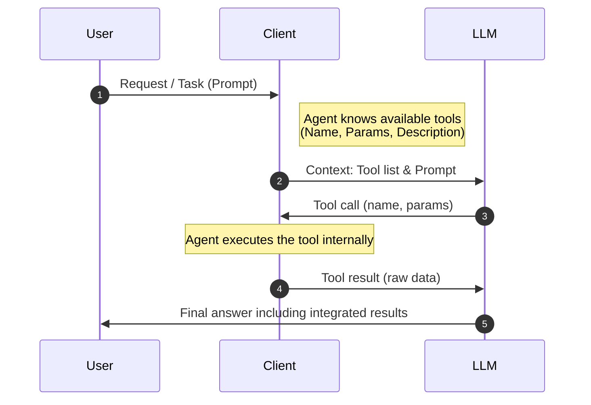
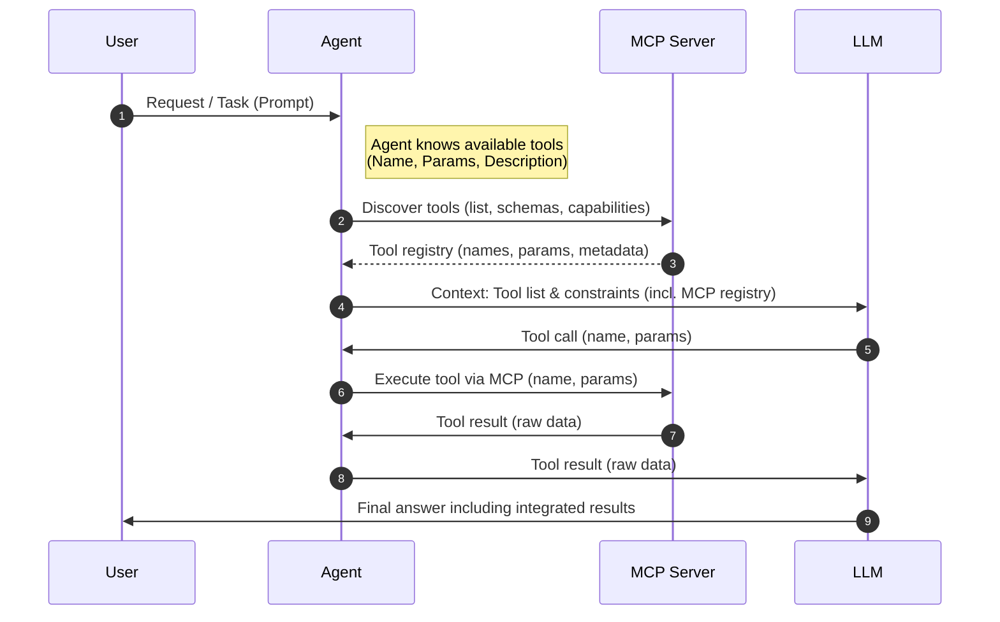

# Tools

---
layout: sidebar
sidebarBackground: petrol
image: /backgrounds/4.webp
---

# Tool-Use

- An agent adds a list of available tools to the context
- The LLM will respond with a special syntax to call the desired tool
- Tools can be used to...
  - read the content of a file
  - create or change a file
  - retrieve diagnostics from the IDE
  - use a basic web browser
- The result from a tool will be sent back to the LLM

::sidebar::

<h3 class="text-center">Giving an agent the <em>ability to act</em></h3>

---

# Tool-Use in Action

---

# Model Context Protocol (MCP)

- A protocol created by Anthropic
- Standardizes tool discovery
- Local and remote MCP Servers
- Protocol defines
  - Transport Layer (STDIO / HTTP)
  - Data Layer
    - Lifecycle Management
    - Server Features
    - Client Features
    - Utility Features

  

    
MCP Host (Assistant)

    

      
MCP Client 1

      
MCP Client 2

    

  

  

    
↓ STDIO

    
↓ HTTP

  

  

    
MCP Server 1 File System

    
MCP Server 2 Jira

  

<!--
MCP hat inzwischen den Retrieval Part ersetzt.

Deswegen gehen wir auf den nicht weiter ein
-->

---

# Tool-Call using an MCP-Server

