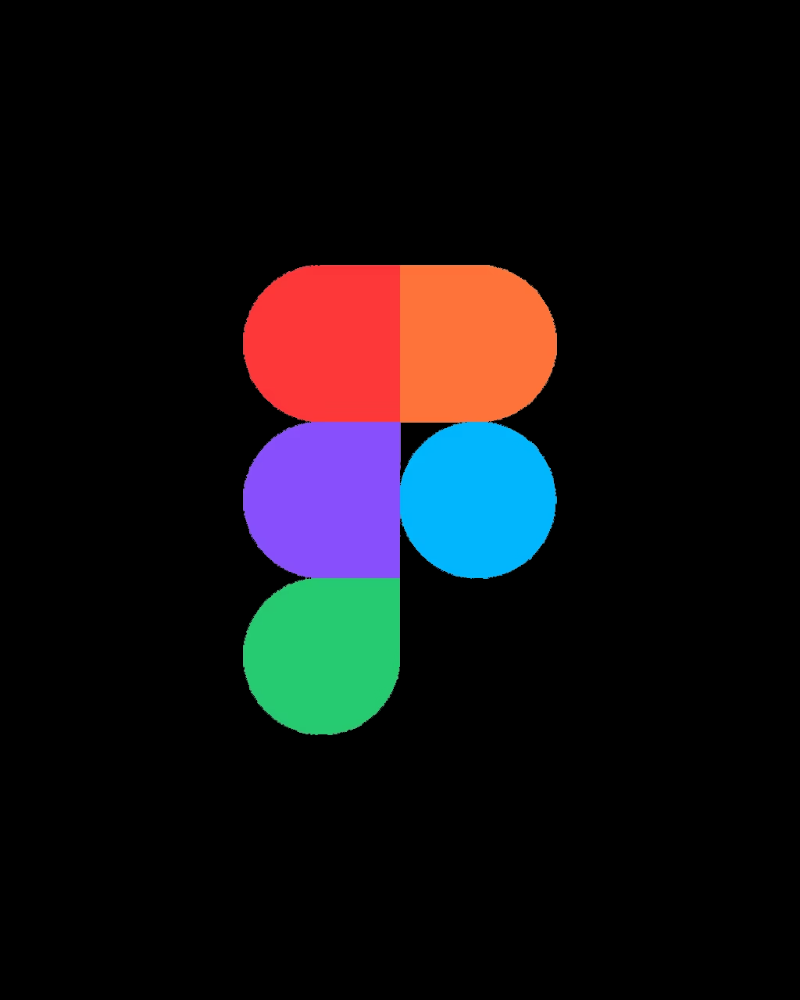
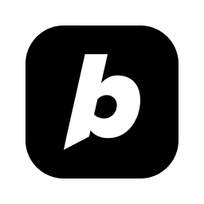
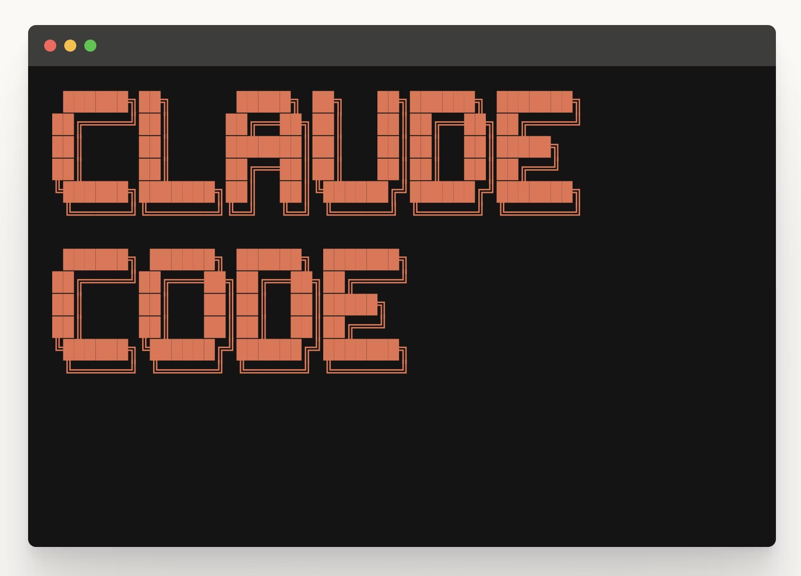
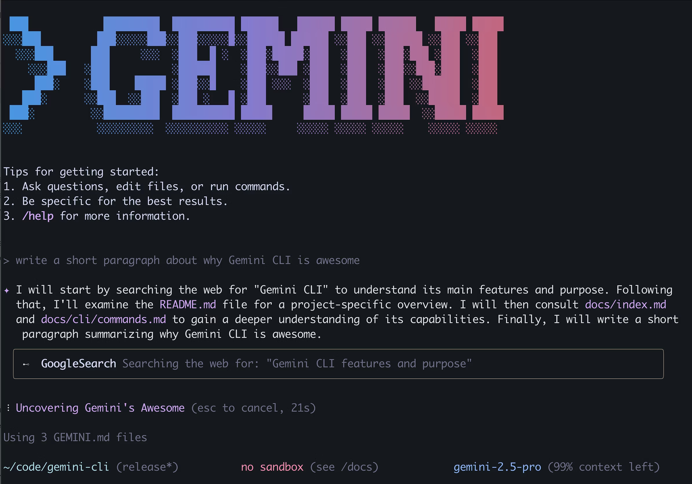

### *Agent assisted generation of*
# Prototypes

---

# What are prototypes good for?

👌

- Making ideas visible and testable - get early feedback
- Communication and alignment - create shared understanding within the team and among stakeholders
- Reduce risk - identify problems early (better in prototype than production)
- Iterate quickly - test and adjust designs without too much code

---

# What are challenges of prototyping?

☝️

- Time-consuming - expensive to create (especially interactions and states)
- Throwaway product - prototypes are not production code
- Quickly outdated - prototype and reality drift apart
- Fidelity dilemma - stakeholders confuse fidelity with completion
- False expectations - technical feasibility gets overlooked
- Missing documentation - prototype shows what, but not why
- Technical limitations - real data, states, edge cases are hard to represent

---

# Ingredients of a prototype

🥗

- Context and goals - user research, scenarios, product vision
- Design system - color, typography, branding, spacing, components
- Interaction design - user flows, information architecture
- Tone and voice - wording and terminology guidelines, microcopy
- Product requirements - personas, user journeys, user stories, ...
- Visual references - sketches, wireframes, mood boards, screenshots

---

# Prototyping Tools

### *AI-assisted design*

<LogoRow class="mt-12 h-[360px]">
  <LogoCard name="Framer">
    
  </LogoCard>
  <LogoCard name="Figma">
    
  </LogoCard>
  <LogoCard name="Sketch">
    
  </LogoCard>
</LogoRow>

---

# Prototyping Tools

### *AI-assisted (vibe) coding*

<LogoRow class="mt-8">
  <LogoCard name="Lovable">
    
  </LogoCard>
  <LogoCard name="replit">
    
  </LogoCard>
  <LogoCard name="bolt">
    
  </LogoCard>
  <LogoCard name="v0">
    
  </LogoCard>
  <LogoCard name="Galileo">
    
  </LogoCard>
</LogoRow>

🪦

---

# Prototyping Tools

### *General-purpose AI chatbots*

<LogoRow class="mt-16 h-[320px]">
  <LogoCard name="ChatGPT" subtitle="OpenAI">
    
  </LogoCard>
  <LogoCard name="Claude" subtitle="Anthropic">
    
  </LogoCard>
</LogoRow>

<!--
Chat-Interfaces sind perfekt für Einzelfragen, Brainstorming, Code-Erklärungen. Schnell zugänglich, aber ohne Persistenz.
-->

---

# Prototyping Tools

### *Agentic Coding*

<LogoRow class="mt-8">
  <LogoCard name="Claude Code" subtitle="Anthropic">
    
  </LogoCard>
  <LogoCard name="Gemini CLI" subtitle="Google">
    
  </LogoCard>
  <LogoCard name="Amp Code CLI">
    
  </LogoCard>
</LogoRow>

<LogoRow class="mt-10">
  <LogoCard name="OpenAI Codex CLI">
    
  </LogoCard>
  <LogoCard name="Anomaly">
    
  </LogoCard>
  <LogoCard name="GitHub Copilot CLI">
    
  </LogoCard>
</LogoRow>

---

# Prototyping Recommendations

- Use prototypes to quickly test assumptions and add a visual layer to other requirements (like user stories)
- Prototypes should be part of the planning process
- Non-technical people can generate web-based prototypes
- For example:
  - Using HTML, CSS and JavaScript
  - Including a UI component library like Bootstrap, ShadCN, Preline, etc.
  - Or using classic design tools like Figma
- Use your existing baseline documentation to get good results

