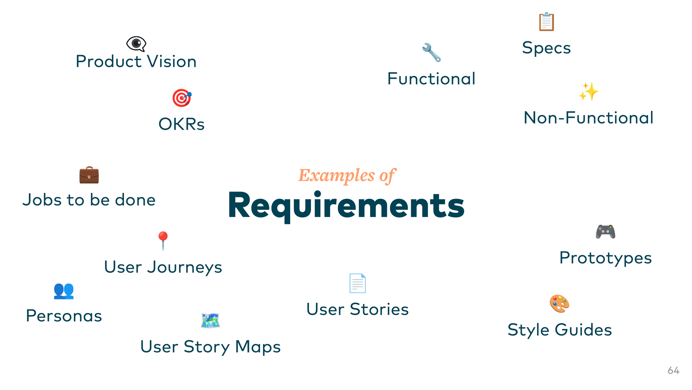

### *Agent assisted documentation of*
# Human-centered Requirements

<!--
Wir erstellen sinnvolle Dokumentation die sowohl für Menschen als auch KI nützlich ist.
-->

---
layout: center
---

---
layout: center
---

  
Beware

  

    

      <h2 class="!text-4xl">Random</h2>
      
Context

    

    
+

    

      <h2 class="!text-4xl">Vague</h2>
      
Prompts

    

    
=

    

      <h2 class="!text-4xl">Generated</h2>
      
Requirements

    

  

  
❌

---
layout: center
---

  
Our Goal

  

    

      <h2 class="!text-3xl">Engineered Context</h2>
      
Specific requirements crafted and verified by groups of humans

    

    
+

    

      <h2 class="!text-3xl">Tailored Prompts</h2>
      
Detailed instructions based on proven methodologies

    

    
=

    

      <h2 class="!text-3xl">Generated Documentation</h2>
      
Accessible output that includes feedback from humans

    

  

  
✅

---
layout: center
---

  
How to Get There

  

    

      

        
📚

        <h2 class="!text-5xl mt-2">Baseline</h2>
      

      <ul class="text-2xl leading-relaxed list-none pl-0">
        <li>Glossary</li>
        <li>Dossiers</li>
        <li>Concepts</li>
        <li>Meeting Summaries</li>
        <li>Studies, Research & Statistics</li>
        <li>Other internal documents</li>
        <li>...</li>
      </ul>
    

    

      
↗

      

        
📝

        <h2 class="!text-4xl mt-2">Generated Documentation</h2>
      

      

        
📄

        <h2 class="!text-4xl mt-2">Refined Documentation</h2>
      

      
↙

    

    

      
↘

      

        
💬

        <h2 class="!text-5xl mt-2">Human Feedback</h2>
      

      
↖

    

  

  
+

  

    
🧰

    
Prompts

  

---
layout: center
---

  <h2 class="!text-5xl !leading-tight max-w-4xl mx-auto">But first, we need to convert an existing baseline into a usable format for agents.</h2>
  
For example Markdown

---

# Glossary

## What is?

- Contains most crucial domain and technical terms
- Define terms so that all stakeholders have a shared understanding of these terms
- Avoid using synonyms and homonyms

  Example: Standing Reservation - A permanent, ongoing booking for specific times, typically used for regular meetings or departments with priority access.

