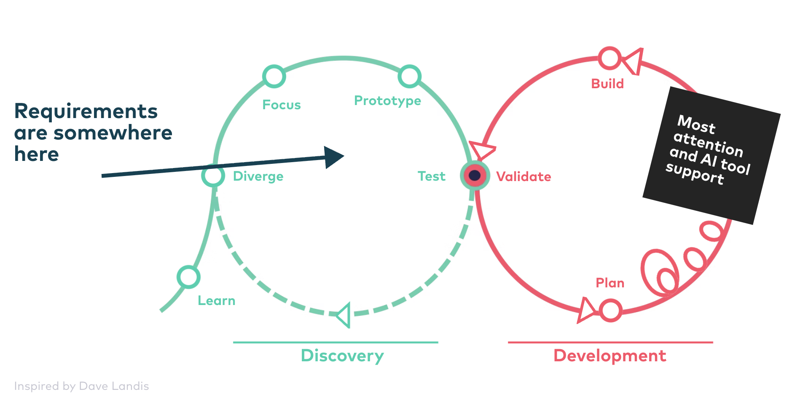

# Requirements with Generative AI

<!-- Master reference: Chapter 2 / Slide 060 -->

---
layout: center
---

  
🏎️

  

    <h2 class="!text-5xl !leading-tight">A 10x faster engine</h2>
    
demands chassis, brakes, etc. to scale accordingly

  

<!-- Master reference: Chapter 2 / Slide 061 -->

---
layout: center
---

# AI in the Product Development Cycle

Inspired by Dave Landis

<!-- Master reference: Chapter 2 / Slide 062 -->

---
src: ./agent-assisted-requirements/slides.md
---

---
layout: intro
background: petrol
---

### *Introduction to*
# Claude Code

<!-- Master reference: Chapter 2 / Slide 070 -->

---
src: ./proto-personas/slides.md
---

---
layout: exercise
chapter: 2
exercise: 2
task: Create a Proto Persona
command: git switch uebung-1-2
---

<!-- Master reference: Chapter 2 / Slide 074 -->

---
src: ./prompting-techniques/slides.md
---

---
src: ./user-journeys/slides.md
---

---
src: ./user-story-maps/slides.md
---

---
src: ./epics/slides.md
---

---
layout: exercise
chapter: 2
exercise: 3
task: Create epics
command: git switch uebung-1-3
---

<!-- Master reference: Chapter 2 / Slide 087 -->

---
src: ./user-stories/slides.md
---

---
layout: exercise
chapter: 2
exercise: 4
task: Create user stories
command: git switch uebung-1-4
---

<!-- Master reference: Chapter 2 / Slide 091 -->

---
layout: exercise
chapter: 2
exercise: 5
task: Split a user story
command: git switch uebung-1-5
---

<!-- Master reference: Chapter 2 / Slide 092 -->

---
src: ./agent-assisted-prototypes/slides.md
---

---
layout: center
background: petrol
---

## Chapter 2 -- Key Takeaways

<!-- Master reference: Chapter 2 / Slide 102 -->

---
layout: center
background: petrol
---

  
Take Away

  <h2 class="!text-5xl !leading-tight max-w-3xl mx-auto">Invite AI to the table in all areas of product development.</h2>

<!-- Master reference: Chapter 2 / Slide 103 -->

---
layout: center
background: petrol
---

  
Take Away

  <h2 class="!text-5xl !leading-tight max-w-4xl mx-auto">Most of the discovery work has already happened before AI enters the picture.</h2>

<!-- Master reference: Chapter 2 / Slide 104 -->

---
layout: center
background: petrol
---

  
Take Away

  <h2 class="!text-5xl !leading-tight max-w-4xl mx-auto">Agents amplify the existing foundation of product discovery, either positively or negatively.</h2>

<!-- Master reference: Chapter 2 / Slide 105 -->

---
layout: center
background: petrol
---

  
Take Away

  <h2 class="!text-5xl !leading-tight max-w-4xl mx-auto">Documentation that is accessible and easy to consume for humans also works very well for AI agents.</h2>

<!-- Master reference: Chapter 2 / Slide 106 -->
