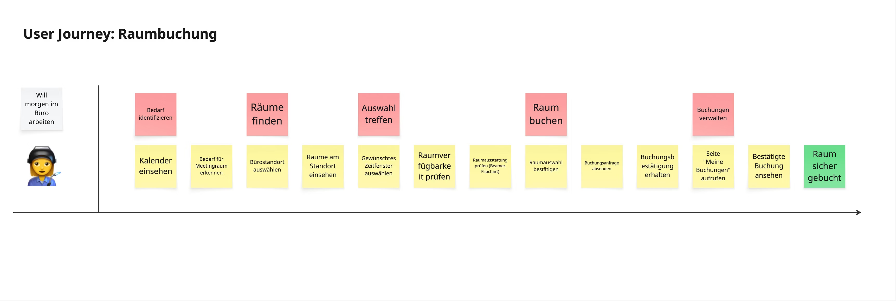

### *Let's talk about*
# User Journeys

---

# User Journeys

## What are?

  
Origin: Service Design, popularized by Adaptive Path and IDEO

  
Purpose: Visualizes the user experience across all touchpoints. Identifies pain points and optimization opportunities in user interaction.

  
Recommended Input: Workshop artifacts, proto-personas, user research, current state analysis, touchpoint inventory, customer feedback

---

# User Journeys

## Example

