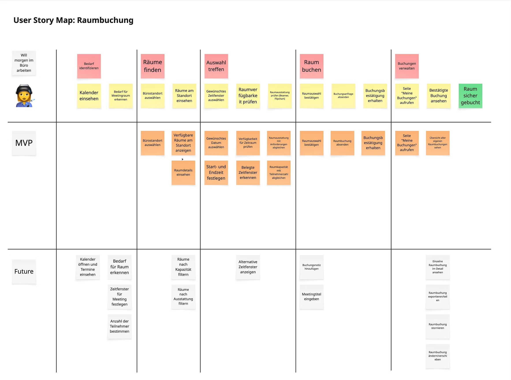

### *Let's talk about*
# User Story Maps

---

# User Story Maps

## What are?

  
Origin: User Story Mapping by Jeff Patton

  
Purpose: Organizes user stories in a two-dimensional representation. Uses a user journey as a basis. Helps with prioritization and understanding of the user journey from a development perspective.

  
Recommended Input: Workshop artefacts, user journeys, UX docs, proto-personas, meeting transcripts

---

# User Story Maps

## Example

