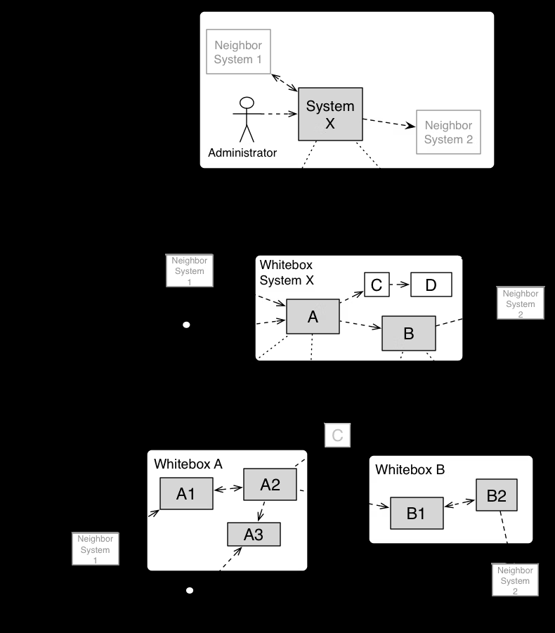

### *Use Agents for*
# Documentation

<!-- Master reference: Chapter 3 / Slide 128 -->

---

# Architecture Documentation

## General

- Create central macro architecture documentation
- Create microarchitecture documentation for each system
- Document just the important parts
- Use a template
- Make it available for the agent

## Result

- Prevents forgetting
- Minimizes know-how transfer and searching
- Agents can work on it

<!-- Master reference: Chapter 3 / Slide 129 -->

---
layout: two-cols
---

::left::

# Arc42

## Template

- 12 chapters for documentation
- Just use what is important for your system
- Created by Gernot Starke

::right::

1. Introduction and goals
2. Constraints
3. Context and scope
4. Solution strategy
5. Building block view
6. Runtime view
7. Deployment view
8. Crosscutting concepts
9. Architectural decisions
10. Quality requirements
11. Risks and technical debt
12. Glossary

<!-- Master reference: Chapter 3 / Slide 130 -->

---

# System Context

## Arc42

- Delimits your system from all its communication partners
  - Neighboring systems
  - Users
- Specifies which external interfaces exist
- If necessary, differentiate
  - Business context (domain-specific inputs and outputs)
  - Technical context (channels, protocols, hardware)

<!-- Master reference: Chapter 3 / Slide 131 -->

---
layout: two-cols
---

::left::

# Building Block View

## Arc42

- Static decomposition of the system
- Analogy: the house floor plan
- Level 1 describes the whole system and its contained building blocks
- Level 2 zooms into selected building blocks from level 1
- Level 3 zooms into selected building blocks from level 2, and so on

Source: https://docs.arc42.org/section-5/

::right::

  

<!-- Master reference: Chapter 3 / Slide 132 -->
