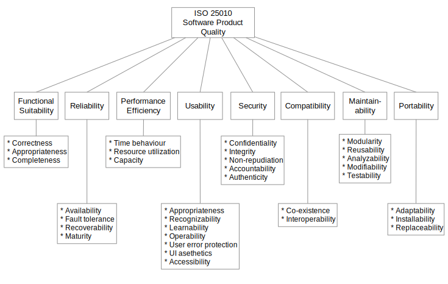
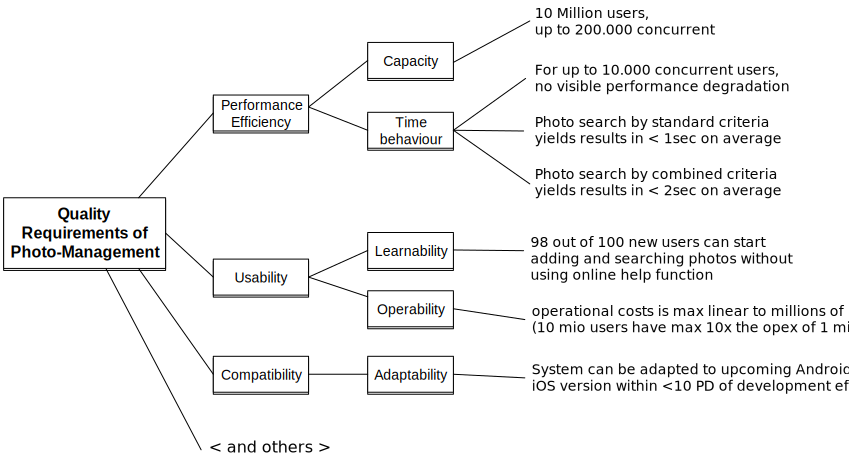

# What is Software Architecture?

🤷
There is no fixed academic definition.

**For us:**  
Decisions in and around the software that are hard to change.

<!--
Es gibt bewusst keine akademisch korrekte Definition – wir wollen pragmatisch vorgehen.

Die Kernerkenntnis: Architektur sind Entscheidungen, die schwer rückgängig zu machen sind. Technologieauswahl, Schnittstellendesign, Teamstruktur – das sind Architekturentscheidungen.

Kleine Dinge wie Variablennamen sind keine Architektur, auch wenn sie im Code stehen.
-->

---

# Software Architecture Areas

- Team structure (Conway's Law)
- Bounded contexts
- Non-functional requirements
- Technologies
- Modularization
- Dependencies
- Code structure
- Decisions and trade-offs

---
layout: center
background: petrol
---

## How can we *leverage agents*
## to support us in these areas?

<!--
Überleitung: Wir haben gesehen, was Softwarearchitektur umfasst. Jetzt schauen wir, wo Agenten konkret helfen können.

Nicht überall – aber bei Qualitätsanforderungen, Entscheidungen und Dokumentation gibt es klare Mehrwerte.
-->

---
layout: intro
background: apricot
---

### *Use Agents for*
# Quality Requirements

---
layout: default
footerLink: https://www.innoq.com/en/articles/2021/08/quality-driven-software-architecture-revised/
---

# Quality Model <small>ISO 25010</small>

<!--
ISO 25010 ist der internationale Standard für Softwarequalität. Er gibt uns eine gemeinsame Sprache für Qualitätsanforderungen.

Die acht Hauptqualitätsbereiche: Functional Suitability, Performance Efficiency, Compatibility, Usability, Reliability, Security, Maintainability, Portability.

Wichtig: Nicht alle Qualitätsbereiche sind für jedes System gleich relevant. Das Ziel ist es, die für das Projekt wichtigen Bereiche zu identifizieren und zu priorisieren.
-->

---
footerLink: https://www.innoq.com/en/articles/2021/08/quality-driven-software-architecture-revised/
---

# Scenarios <small>Quality Tree</small>

<!--
Der Quality Tree konkretisiert abstrakte Qualitätsziele in messbare Szenarien.

Struktur: Qualitätsziel → Qualitätsmerkmal → konkretes Szenario mit Stimulus, Reaktion und Maß.

Ohne konkrete Szenarien bleiben Qualitätsziele wie "das System soll performant sein" nichtssagend. Szenarien machen sie überprüfbar.
-->

---
footerLink: https://www.innoq.com/en/articles/2021/08/quality-driven-software-architecture-revised/
---

# Priorities <small>Quality Tree</small>

    
    1
    2
    3

---

# Document Quality Scenarios

| Prio | Quality | Scenario ID | Scenario |
| --- | --- | --- | --- |
| 1 | Performance efficiency | S1 | 10 million users, 200k concurrent |
| 2 | Performance efficiency | S2 | Up to 10k concurrent users with no visible degradation |
| 3 | Usability | S3 | 98% of new users can start adding photos without online help |
| ... | ... | ... | ... |

---

# Quality Scenario <small>Template</small>

- `Environment`: In normal use
- `Source`: A consultant
- `Event`: Views the bookings of an office
- `Artifact`: On the Calvin website
- `Response`: Bookings are visible and interactive (first contentful paint)
- `Measure`: In 300ms for 95% of requests

---

# Gather <small>Quality Scenarios</small>

Construct a quality scenario, including a reasonable measure, for the following situation:

> A consultant views the bookings of an office on the Calvin website. The bookings are visible and interactive (first contentful paint) in 300ms for 95% of the requests.

<!--
Hier zeigen wir, wie ein Agent ein Szenario aus einer informellen Beschreibung heraus formalisiert.

Der Agent ergänzt dabei Felder wie "Environment", "Source", "Artifact" automatisch aus dem Kontext. Das spart Zeit und sorgt für konsistente Formulierungen im ganzen Projekt.

Demo-Tipp: Prompt an Claude Code zeigen, der aus einer User Story ein vollständiges Qualitätsszenario erstellt.
-->

---

# Prioritize <small>Quality Scenarios</small>

Read in the table of quality scenarios. Find conflicting scenarios and prioritize them while respecting technical complexity and domain-specific need.

> S13 conflicts with S4.
>
> S13 is a scenario for security. S4 is a scenario for usability.
>
> Because this is just a prototype and should not run in production, usability is more important than security. So I would prioritize S4 over S13.

<!--
Priorisierung ist eine der schwierigsten Aufgaben in der Architekturarbeit – es gibt keine objektiv richtige Antwort.

Der Agent hilft dabei, Konflikte zu erkennen und Begründungen zu formulieren. Die fachliche Entscheidung bleibt beim Team.

Wichtig: Der Agent liefert hier eine begründete Empfehlung basierend auf dem gegebenen Kontext ("just a prototype"). Im echten Projekt müsste der Kontext explizit mitgegeben werden.
-->
