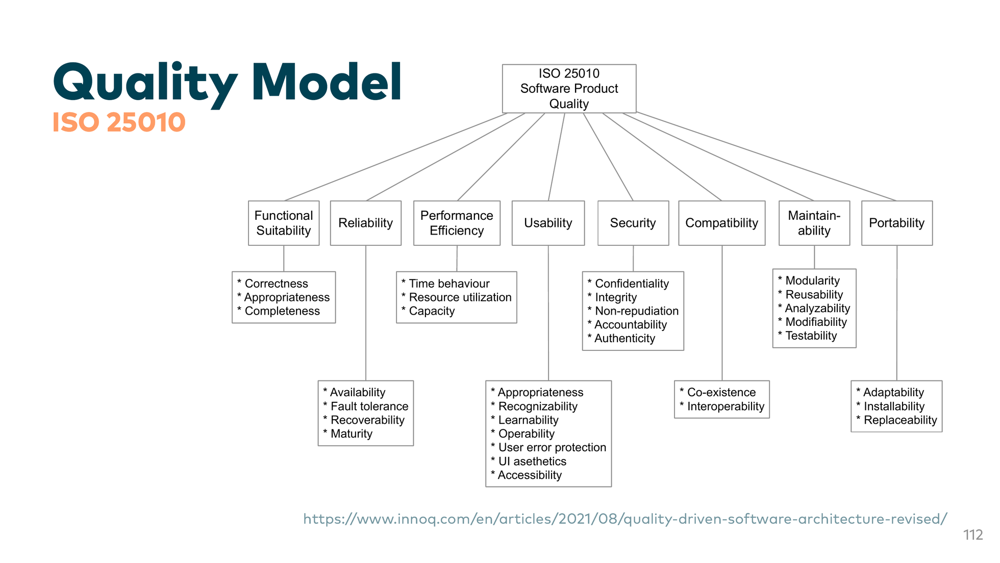
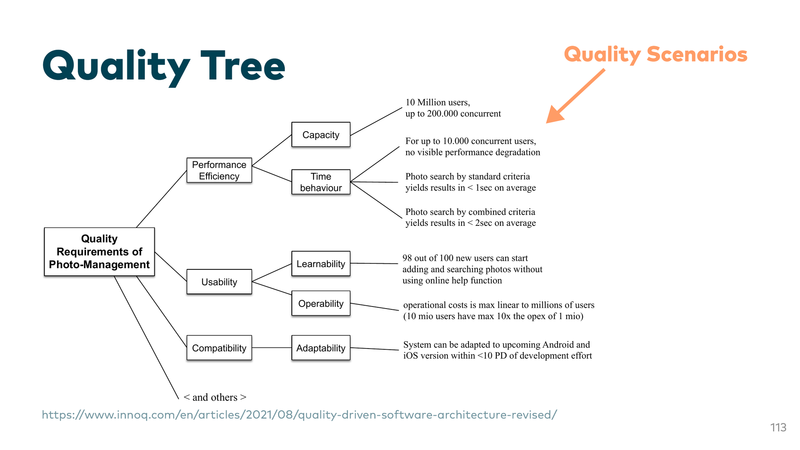
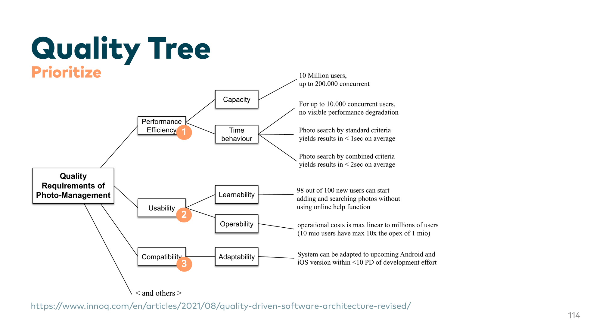

  
🤷

  

    
Definition

    <h2 class="!text-5xl">What is Software Architecture?</h2>
  

  

    
There is no fixed academic definition.

    
For us: Decisions in and around the software that are hard to change.

  

<!-- Master reference: Chapter 3 / Slide 108 -->

---

# Software Architecture

## Areas

- Team structure (Conway's Law)
- Bounded contexts
- Non-functional requirements
- Technologies
- Modularization
- Dependencies
- Code structure
- Decisions and trade-offs

<!-- Master reference: Chapter 3 / Slide 109 -->

---
layout: sidebar
alignContent: center
---

## How can we leverage agents
## to support us in these areas?

::sidebar::

### A guiding
### *question*

<!-- Master reference: Chapter 3 / Slide 110 -->

---
layout: intro
background: petrol
---

### *Use Agents for*
# Quality Requirements

<!-- Master reference: Chapter 3 / Slide 111 -->

---
layout: center
---

<!-- Master reference: Chapter 3 / Slide 112 -->

---
layout: center
---

<!-- Master reference: Chapter 3 / Slide 113 -->

---
layout: center
---

<!-- Master reference: Chapter 3 / Slide 114 -->

---

# Document Qualities as a Table

| Prio | Quality | Scenario ID | Scenario |
| --- | --- | --- | --- |
| 1 | Performance efficiency | S1 | 10 million users, 200k concurrent |
| 2 | Performance efficiency | S2 | Up to 10k concurrent users with no visible degradation |
| 3 | Usability | S3 | 98% of new users can start adding photos without online help |
| ... | ... | ... | ... |

<!-- Master reference: Chapter 3 / Slide 115 -->

---

# Quality Scenario Template

- `Environment`: In normal use
- `Source`: A consultant
- `Event`: Views the bookings of an office
- `Artifact`: On the Calvin website
- `Response`: Bookings are visible and interactive (first contentful paint)
- `Measure`: In 300ms for 95% of requests

<!-- Master reference: Chapter 3 / Slide 116 -->

---

# Agents for Quality Scenarios

## Gather

Construct a quality scenario, including a reasonable measure, for the following situation:

> A consultant views the bookings of an office on the Calvin website. The bookings are visible and interactive (first contentful paint) in 300ms for 95% of the requests.

<!-- Master reference: Chapter 3 / Slide 117 -->

---

# Agents for Quality Scenarios

## Prioritize

Read in the table of quality scenarios. Find conflicting scenarios and prioritize them while respecting technical complexity and domain-specific need.

> S13 conflicts with S4.
>
> S13 is a scenario for security. S4 is a scenario for usability.
>
> Because this is just a prototype and should not run in production, usability is more important than security. So I would prioritize S4 over S13.

<!-- Master reference: Chapter 3 / Slide 118 -->
