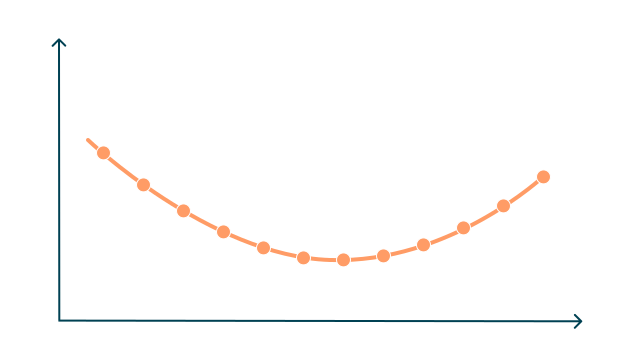

# Dealing with context is *hard*.

---
layout: sidebar
sidebarBackground: petrol
alignContent: center
---

<h2 text-balance>Context gets too large for the model</h2>

- The context window is exceeded
- Older content is silently dropped once the limit is hit
- Long prompts can get expensive (`tokens = cost`)
- Important info might fall out of context without warning

::sidebar::

  <h3 class="[&_em]:text-apricot"><em>Problem 1</em></h3>
  <h1 class="text-white">Overflow</h1>

<!--
Ihr wisst nun dass die Kontextgröße begrenzt ist. Zu viel Inhalt sorgt dafür, dass ältere Informationen still aus dem Kontext rausfallen – ohne Warnung.
-->

---
layout: sidebar
sidebarBackground: petrol
alignContent: center
---

<h2 text-balance>Context includes irrelevant or noisy information</h2>

- Too much noise reduces answer quality
- The model may miss the point or give generic responses
- LLMs can latch onto unimportant details
- Makes prompting and control harder
- Better prompt structure or pre-filtering helps a lot

::sidebar::

  <h3 class="[&_em]:text-apricot"><em>Problem 2</em></h3>
  <h1 class="text-white">Distraction</h1>

<!--
Distraction: Irrelevante Informationen lenken das LLM von der eigentlichen Aufgabe ab. Ein README mit Installationsanweisungen beim Code-Review ist Distraction.
-->

---
layout: sidebar
sidebarBackground: petrol
alignContent: center
---

<h2 text-balance>Context includes harmful or manipulative content</h2>

- Can happen on purpose or not
- LLMs might pick up and repeat poisoned inputs
- Prompt injection or jailbreaks become possible
- Can happen through user input, plugins, files, APIs, or even system prompts
- Needs sanitizing, context validation, or guardrails

::sidebar::

  <h3 class="[&_em]:text-apricot"><em>Problem 3</em></h3>
  <h1 class="text-white">Poisoning</h1>

---
layout: sidebar
sidebarBackground: petrol
alignContent: center
---

<h2 text-balance>Fuzzy, vague, or ambiguous inputs confuse the model</h2>

- Inputs are unclear, loosely worded, or open to interpretation
- Similar but slightly different ideas are mixed together
- The prompt lacks precision or does not specify what matters most
- The LLM might average or merge things that should stay separate
- Often caused by bad prompts, overly abstract context, or lack of structure

::sidebar::

  <h3 class="[&_em]:text-apricot"><em>Problem 4</em></h3>
  <h1 class="text-white">Confusion</h1>

---
layout: sidebar
sidebarBackground: petrol
alignContent: center
---

<h2 text-balance>Contradictory statements within the context</h2>

- Two or more sources explicitly disagree on a point
- The model cannot resolve who is right and may pick randomly
- Order of information matters; recency bias is real
- Creates unreliable or misleading outputs
- Especially dangerous in fact-based or regulated use cases

::sidebar::

  <h3 class="[&_em]:text-apricot"><em>Problem 5</em></h3>
  <h1 class="text-white">Clash</h1>

---
layout: sidebar
sidebarBackground: petrol
alignContent: center
---

<h2 text-balance>LLMs degrade as context gets longer</h2>

- Earlier information gets less attention
- Long context does not equal better results
- Even trivial tasks fail when buried deep in context
- One irrelevant chunk can hurt accuracy
- Shuffled text can outperform well-structured docs
- Lost in the middle is real; central tokens have less impact

::sidebar::

  <h3 class="[&_em]:text-apricot"><em>Problem 6</em></h3>
  <h1 class="text-white">Rot</h1>

---
layout: center
---

## „Lost in the middle”

    
    

        Impact on output
    

    

        Position in conversation
    

https://cs.stanford.edu/~nfliu/papers/lost-in-the-middle.arxiv2023.pdf

