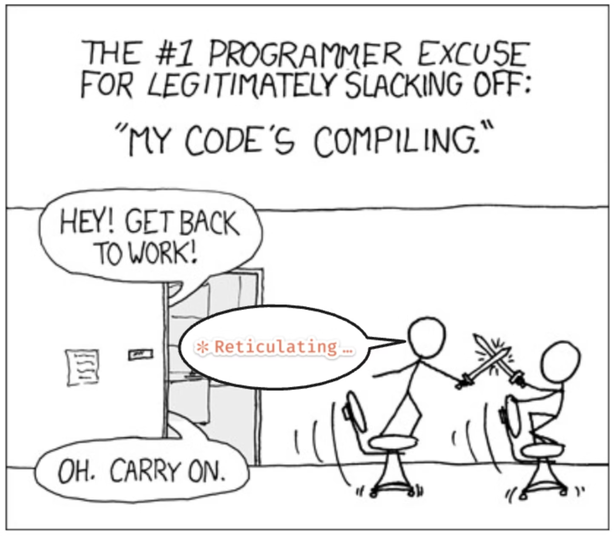

# Accelerating Implementation

<!--
Auf Basis der ganzen Dokumente die wir in der Produkt- und Architekturplanung erzeugt haben, können wir nun die Implementierung beginnen.
-->

---
src: ./context-challenges/slides.md
---

---
layout: intro
background: petrol
---

### *Agent Features*
# From *Primitives* to *Control*

<!--
Wir bauen jetzt das mentale Modell für alles, was ein Agent ausmacht.
Drei Ebenen, die du dir merken solltest.
-->

---
layout: default
background: white
---

# Three Levels

  

    
Level 1 — Block A

    <h2 class="!text-3xl !mb-4">Primitives</h2>
    
What the agent <em>has</em>

  

  

    
Level 2 — Block B

    <h2 class="!text-3xl !mb-4">Modes</h2>
    
How the agent <em>operates</em>

  

  

    
Level 3 — Block C

    <h2 class="!text-3xl !mb-4">Control</h2>
    
How <em>I stay</em> in charge

  

<!--
Drei Ebenen, ein roter Faden.

Block A — die Primitives. Was hat der Agent? Memory, Instructions, Tools, Verification, Delegation.
Das sind die fünf Bausteine.

Block B — die Modes. Wenn ich an den Primitives schraube, bekomme ich verschiedene Profile:
Planning, Assisted, Autopilot, YOLO, Research.

Block C — die operative Kontrolle. Wenn der Agent läuft, wie behalte ich den Überblick?
Session, Fleet, Ecosystem.
-->

---
src: ./context-management/slides.md
---

---
src: ./agent-modes/slides.md
---

---
src: ./additional-agent-features/slides.md
---

---
layout: exercise
chapter: 4
exercise: 1 + 2
task: Setup backend development
command: git switch main
---

---
src: ./agent-setup/slides.md
---

---
layout: intro
background: petrol
---

### *Development*
# Processes

---
src: ./autonomy-and-topology/slides.md
---

---
background: white
---

# From Spectrum to Practice

We skip the old normal & zoom into the agentic end

  
<EmojiStack emoji="🙌" size="lg">
Manual
</EmojiStack>

  
<EmojiStack emoji="💪" size="lg">
Assisted
</EmojiStack>

  
<EmojiStack emoji="📋" size="lg">
SDD

deep dive
</EmojiStack>

  
<EmojiStack emoji="🛡️" size="lg">
Harness

deep dive
</EmojiStack>

  
<EmojiStack emoji="🏄" size="lg">
Vibed

deep dive
</EmojiStack>

  
<EmojiStack emoji="🏭" size="lg">
Autonomous
</EmojiStack>

  
1 <strong>Vibe Coding</strong>

  
2 <strong>Spec-Driven Development</strong>

  
3 <strong>Harness Engineering</strong>

<!--
Übergang vom Spektrum in die Praxis. Manual und Assisted sind der alte Normalfall — die
lassen wir bewusst links liegen, darüber müssen wir nicht weiter reden. Autonomous ist das
ganz andere Ende: die "Software-Factory" — das vertiefen wir erst in Kapitel 9.

Wir zoomen jetzt ins agentische Feld und gehen drei Wege durch: zuerst Vibe Coding (der
wilde Einstieg), dann Spec-Driven Development (Disziplin), dann Harness Engineering (die
konstruierte Mitte — Ziel + Constraints + Validierung).
-->

---
src: ./vibe-coding/slides.md
---

---
src: ./spec-driven-development/slides.md
---

---
src: ./harness-engineering/slides.md
---

---
src: ./coding-with-agents/slides.md
---

---
layout: exercise
chapter: 4
exercise: 6
task: Coding Buddy
command: git merge uebung-3-6
---

---
layout: exercise
chapter: 4
exercise: 7
task: Create a pull request
command: git merge uebung-3-7
---

---
layout: exercise
chapter: 4
exercise: 8
task: Making Reviews
command: git merge uebung-3-8
---

---
layout: chapter
background: /backgrounds/4.webp
label: Recap
---

# Day 2

---
layout: intro
background: apricot
---

### *What is?*
# Vibe Coding

---
layout: intro
background: apricot
---

### *How can we use?*
# Test Driven Development

---
layout: intro
background: apricot
---

### *What is?*
# Spec Driven Development

---
src: ./development-use-cases/slides.md
---

---
layout: exercise
chapter: 4
exercise: 9
task: Optimize context with subagents
command: git merge uebung-3-9
---

---
layout: center
---

---
layout: exercise
chapter: 4
exercise: 10
task: Parallelize work
command: git merge uebung-3-10
---

---
src: ./token-economy/slides.md
---

---
layout: takeaways
chapter: 4
---

1. Curated context enables bigger tasks
2. Use TDD to enhance the feedback loop
3. You push it, you own it
4. No vibe coding for production

