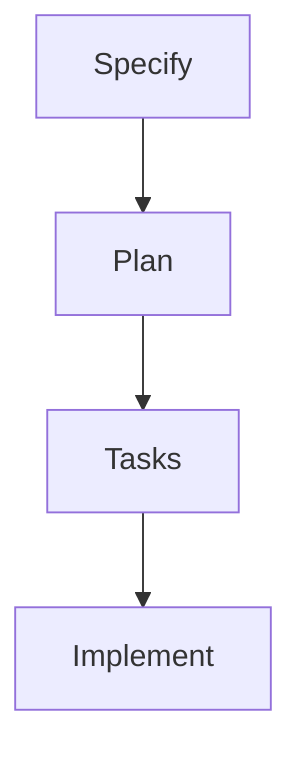

### *Let's talk about*
# Spec Driven Development

<!-- Master reference: Chapter 4 / Slide 173 -->

---
layout: two-cols
leftBackground: white
rightBackground: white
alignContent: center
---

::left::

# Spec Driven Development

- New term popularized by GitHub
- Announced with SpecKit
- Tooling around a fixed dev process
- Tells an agent exactly how to code

  
::right::

<!-- Master reference: Chapter 4 / Slide 174 -->

---

# 1. Specify

Use existing documentation like
- Epics and user stories
- Wikis
- Architecture documentation
- UX documentation

**Important:**

1. The agent must have access
2. Keep it close to the agent
3. Use text-based formats

<!-- Master reference: Chapter 4 / Slide 175 -->

---

# 2. Plan

Create a plan for implementing the specs.

- What are the specs?
- How exactly do we meet the acceptance criteria?
- How does that affect the architecture?
- How does that change the domain model?
- Do we have to migrate the database?
- ...

<!-- Master reference: Chapter 4 / Slide 176 -->

---

# 3. Tasks

- Split the plan into small, reviewable chunks
- If possible, create independent tasks
  - This enables working with multiple agents without merge conflicts
- Each task contains all information needed to start implementation

<!-- Master reference: Chapter 4 / Slide 177 -->

---

# 4. Implement

- Implement the tasks
- Review the code
- Use specialized agents and set up feedback loops
  - Database migration expert -> needs database access
  - Backend developer -> can test the backend
  - Frontend developer -> has browser access
  - Debugging expert -> has access to logs and debugger
  - ...

<!-- Master reference: Chapter 4 / Slide 178 -->

---
layout: default
background: white
---

# Specs vs. Memory

  

    <h3 class="!text-3xl !mb-4">Memory Bank</h3>
    

      
Agents.md

      
Arc42.md

      
Requirements.md

      
...

    

  

  

    <h3 class="!text-3xl !mb-4">Specs</h3>
    

      
Story-042

      
Subtask-123

      
Plan-123

      
...

    

  

<!-- Master reference: Chapter 4 / Slide 179 -->

---
layout: multi-col
---

::header::

<h1 class="text-petrol !text-5xl !mb-8">Spec Implementation Levels</h1>

  

    
Spec First

    

      
1.

Write a Spec

      
2.

Use the Spec when implementing

      
3.

Throw the spec away

    

  

  

    
Spec Anchored

    

      
1.

Write a Spec

      
2.

Use the Spec when implementing

      
3.

Keep the Spec

      
4.

Update the Spec when something changes

    

  

  

    
Spec as Source

    

      
1.

Write a Spec

      
2.

Use the Spec when implementing

      
3.

Keep the Spec

      
4.

Update the Spec when something changes

      
5.

Throw away the code and rebuild from Spec

    

  

---

# SDD Frameworks

  

    <h3 class="!text-3xl !mb-6">Spec Kit</h3>
    
https://github.github.com/spec-kit/

  

  

    <h3 class="!text-3xl !mb-6">OpenSpec</h3>
    
https://openspec.dev/

  

  

    <h3 class="!text-3xl !mb-6">BMAD</h3>
    
https://docs.bmad-method.org/

  

  

    <h3 class="!text-3xl !mb-6">Tessl</h3>
    
https://tessl.io

  

---
layout: exercise
chapter: 4
exercise: 5
task: Planning & Task Breakdown
command: git merge uebung-3-5
---

<!-- Master reference: Chapter 4 / Slide 180 -->
