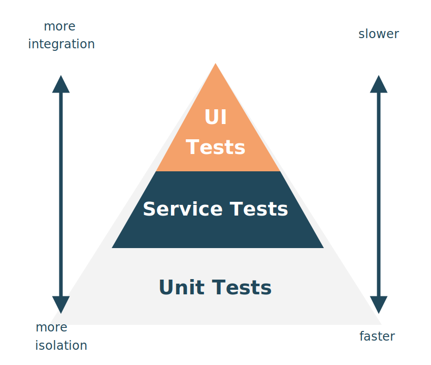

### *Let's talk about*
# Testing

---
layout: default
---

# Automated Testing

- Manual testing is error prone & time consuming
- You can never be safe to push a new feature
- We want to be safe not to break something
- If the team changes, the system becomes unmaintainable without tests

**We want automated tests to enable continuous deployment.**

<!--
Ohne automatisierte Tests wird jede Änderung zum Risiko. Das Team traut sich nichts mehr zu refactoren oder zu deployen.

Continuous Deployment ist ohne eine gute Testabdeckung kaum möglich.
-->

---
layout: two-cols
leftBackground: white
rightBackground: white
---

::left::

# Test Pyramid

By Mike Cohn in *Succeeding with Agile*
Tests with different granularity.
The higher the level, the fewer the tests.

But: oversimplified with just 3 layers.

::right::

  

<!--
Die Test Pyramid gibt uns eine Heuristik: Viele schnelle Unit Tests unten, wenige langsame E2E Tests oben.

In der Praxis hat sich gezeigt, dass 3 Ebenen zu simpel sind – z.B. fehlen Service-Tests oder Contract-Tests.

Trotzdem: gutes mentales Modell, um eine ausgewogene Testsuite zu planen.
-->

---
layout: intro
background: apricot
---

### *Use Agents to generate*
# Unit Tests

---
layout: default
---

# Unit Tests

- Testing individual components or functions in isolation
- External dependencies are "mocked"
- Tests are repeatable
- Tests started with test framework (e.g. JUnit, Jest, NUnit, ...)
- Lightweight tests
- Ideal to test domain specific logic in isolation

<!--
Unit Tests sind die Basis. Schnell, isoliert, deterministisch.

Mocking ist wichtig: Der Test soll nur die eine Unit testen, nicht ihre Abhängigkeiten.
-->

---
layout: default
---

# Unit Tests: <small>Example</small>

- **Arrange:** Setup test environment & test data
- **Act:** Call the unit of code
- **Assert:** Compare expected with actual results

<!--
AAA-Pattern: Arrange, Act, Assert.

Agents kennen dieses Muster und halten sich daran – das macht generierte Tests leicht lesbar und wartbar.
-->

---
layout: default
---

# Unit Tests: <small>Agentic Use Cases</small>

- Use test-driven development and generate unit tests before writing code
- Generate tests for existing code
- Identify edge cases that are not tested already

<!--
TDD mit Agents: Tests zuerst schreiben, dann den Agent den Code implementieren lassen.

Vorteil: Der Agent weiß wann er fertig ist – nämlich wenn alle Tests grün sind.

Edge Cases: Agents finden systematisch Grenzfälle, die Menschen beim Schreiben oft übersehen.
-->

---
layout: exercise
chapter: 5
exercise: 1
task: Write unit tests
---

---
layout: intro
background: apricot
---

### *Use Agents to generate*
# Integration Tests

---
layout: default
---

# Integration Tests

- Testing integration with other parts like
  - Databases
  - Filesystems
  - Network calls
- Run application + other needed parts
- Verify integration is working

<!--
Integration Tests testen das Zusammenspiel mit echten externen Systemen.

Das ist aufwendiger als Unit Tests – aber wichtig: Mocks können echte Datenbankverhalten nicht vollständig abbilden.
-->

---
layout: default
---

# Integration Tests <small>Example</small>

<ol class="list-decimal pl-5 text-left marker:text-apricot">
  <li>Start a database</li>
  <li>Connect to the database</li>
  <li>Trigger a function that writes to the database</li>
  <li>Verify the data has been written to the database</li>
</ol>

<!--
Ein typischer Integration-Test-Ablauf: Infrastruktur hochfahren, Daten schreiben, Ergebnis verifizieren.

Der Agent kann diesen Boilerplate-Code gut generieren – er kennt das Muster.
-->

---
layout: content-with-image
image: /logos/testcontainers.svg
imageFit: contain
---

# Testcontainers

- Starting a database in tests can be challenging
- Use Testcontainers to run databases
- Use Agents to create test data for integration tests

<!--
Testcontainers löst das "echte Datenbank in Tests"-Problem elegant: Docker-Container werden automatisch gestartet und nach dem Test wieder entfernt.

Agents können Testcontainers-Code sehr gut generieren – sie kennen die Library gut.

Testdaten generieren ist ebenfalls eine Stärke von Agents: sinnvolle, realistische Daten auf Knopfdruck.
-->

---
layout: exercise
chapter: 5
exercise: 2
task: Write integration tests
---

---
layout: intro
background: apricot
---

### *Use Agents to generate*
# End-to-End Tests

---
layout: default
---

# End-to-End Tests

- Testing deployed applications via its user interface
- Performed through a headless browser
- Automatically "click" through the application frontend
- Services behind the scenes are real
- Usually take long to execute
- Sometimes fail unexpectedly: false positives
- But ensure critical paths in the system are working

<!--
E2E Tests sind langsam und flaky – aber unverzichtbar für kritische User Journeys.

Agents können mit Playwright oder ähnlichen Tools E2E Tests generieren und sogar direkt im Browser ausführen (MCP).

False positives sind ein reales Problem: Timing-Issues, animierte UI-Elemente, etc. Agents können dabei helfen, stabile Selektoren zu wählen.
-->

---
layout: exercise
chapter: 5
exercise: 3
task: Write end-to-end tests
---

